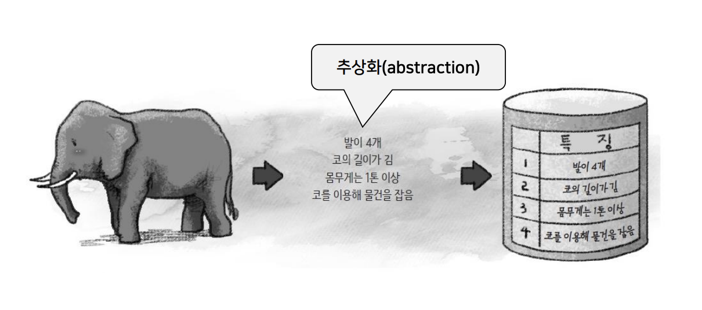

# DB 이론 정리 / 데이터 모델링 이론(ERD)

### Quiz
1. 데이터베이스에서 데이터의 구조와 제약조건을 정의한 것을 무엇이라고 하는가?
A. 스키마
 
2. 스키마에 따라 실제로 저장된 데이터를 무엇이라고 하는가?
A. 인스턴스
 
3. 사용자마다 다른 형태로 데이터를 보여주기 위한 데이터베이스의 단계
A. 외부 단계
 
4. 데이터베이스의 물리적 저장을 정의하는 단계
A. 내부 단계
 
5. 하위 스키마가 변경되어도 상위 스키마가 영향을 받지 않는 성질
A. 데이터 독립성
 

### 모델링이란?
**현실 세계를 분석해서 모델을 만드는 과정**

Real World => DB => Table

### 데이터 모델링
- 현실 세계에 존재하는 대상을 컴퓨터 세계의 데이터 구조로 추상화하는 작업

#### 데이터 모델
- 데이터 모델링의 결과물을 표현하는 구조
- 개념적 데이터 모델, 논리적데이터 모델, 물리적 데이터 모델로 나뉨

### 데이터 모델링 작업 과정
- 현실 세계의 업무 니즈를 파악하고 데이터로 저장할 수 있는 구조를 만드는 작업 과정
 

**요구사항 분석 => 개념적 데이터 모델링 => 논리적 데이터 모델링 => 물리적 데이터 모델링**

**개념적 데이터 모델링**

추상적 개념적으로 나와있는 것들을 도식화 한것

**논리적 데이터 모델링**

개념적 데이터 모델링을 DB에서 사용할 수 있는 형태로 가공한 것

**물리적 데이터 모델링**

실제 SQL 환경에서 사용할 수 있도록 만든것

### 데이터 모델의 구성
- 데이터 구조 data structure
    - 개념적 데이터 모델에서 개념적 구조
    - 논리적 데이터 모델에서 논리적 구조
- 연산 operation
    - 개념 세계나 컴퓨터 세계에서 실제로 표현된 값들을 처리하는 작업
    - 동적 특징
- 제약조건 constraint
    - 데이터 무결성 조건
    - 구조적 측면의 제약 사항
    - 연산을 적용하는 경우 허용할 수 있는 의미적 측면의 제약사항

### 개체-관계 모델
- 핵심요소
    - 개체
    - 속성
    - 관계
 
- 개체-관계 다이어그램(ERD; Entity-Relationship diagram)
    - 현실 세계를 개념적으로 모델링한 결과물을 그림으로 표현한 것

#### 개체
- 현실 세계에서 구분 가능한 대상
- 각 개체만의 고유한 속성을 하나 이상 가지고 있어 다른 개체와 구분 가능
- ERD 표시 : 사각형으로 표현, 안에 이름을 표기

#### 속성
- 개체나 관계가 가지고 있는 고유한 특성
- ERD 표시 : 타원으로 표현, 타원 안에 이름을 표기

#### 속성
- 속성의 종류
    - 속성의 구조, 값의 개수, 생성 방식, 식별 가능성을 기준으로 종류를 구분
    - 단일값 / 다중값 속성
    - 단순 / 복합 속성
    - 저장 / 유도 속성
    - 키 속성(식별자)
 
- 단일값 속성
    - 하나의 속성이 값을 하나만 가질 수 있는 속성
    - ERD : 기본 타원
- 다중 값 속성
    - 하나의 속성이 값을 여러개 가질 수 있는 속성
    - ERD : 이중 타원
 
- 단순 속성
    - 의미를 더 분해할 수 없는 속성
- 복합 속성
    - 의미를 분해할 수 있는 속성
    ex) 주소 = 도 시 동, 생년월일 = 년 월 일
 
- 유도 속성
    - 기존의 다른 속성의 값에서 유도되어 결정되는 속성으로, 데이터베이스에 저장되지 않고 필요시만 계산
    - ERD : 점선 타원으로 표현
- 저장 속성
    - 데이터베이스에 실제로 저장되는 값
 
- 키 속성
    - 각 개체 인스턴스를 식별하는데 사용되는 속성
    - 모든 개체 인스턴스의 키 속성 값은 다름
    - 기본키, 대체키, 후보키가 존재
    - ERD : 밑줄로 표현
- null 속성
    - 널 값이 허용되는 속성
    - ERD : 개념적 데이터 모델에는 표시 없음

#### 관계
- 개체와 개체 사이의 연관성
- 관계도 속성이 있을 수 있음
- ERD : 마름모

*고객과 책은 구매일자, 결제방식이라는 속성을 가지기에는 좀 애매하지 않은가?*

---

> ETC..
A B C D
AI / Big data / CS + Domain

> 핵심 부분들
ERD 디자인
손으로 할 수 있어야 할지도