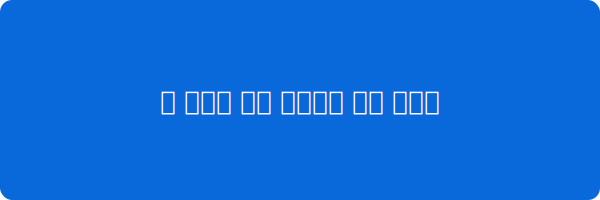

기존에 jeyii를 이용해서 블로그를 만들어 봤었는데, 자유도가 너무 낮아서 일반 html, css를 사용해보기로 했다

## 글에서 쓸 수 있는 요소들

본문에서는 이런 것들을 쓸 수 있다. `인라인 코드`도 되고, 코드 블록도 된다.

```js
// 예시 코드
const blog = "handmade";
console.log(blog);
```

> 인용문은 이렇게 표시된다.

- 목록도
- 당연히 된다

사진은 글 폴더에 같이 넣고 이렇게 참조한다.


