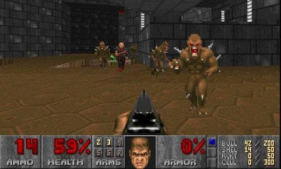
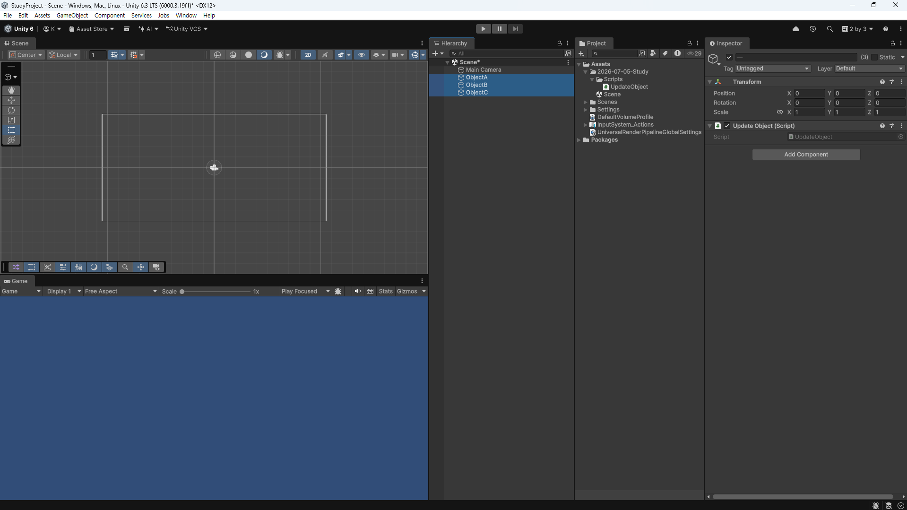
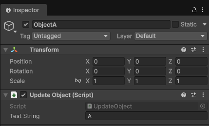
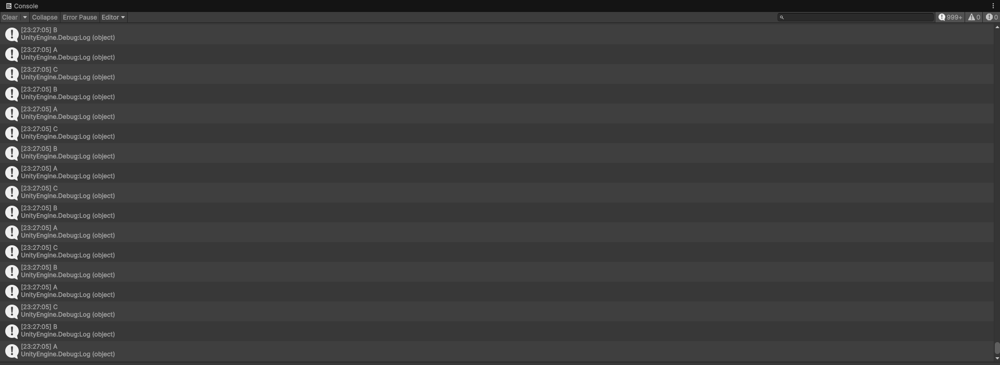
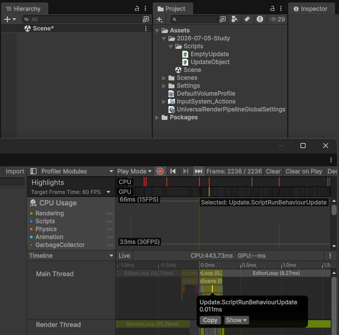
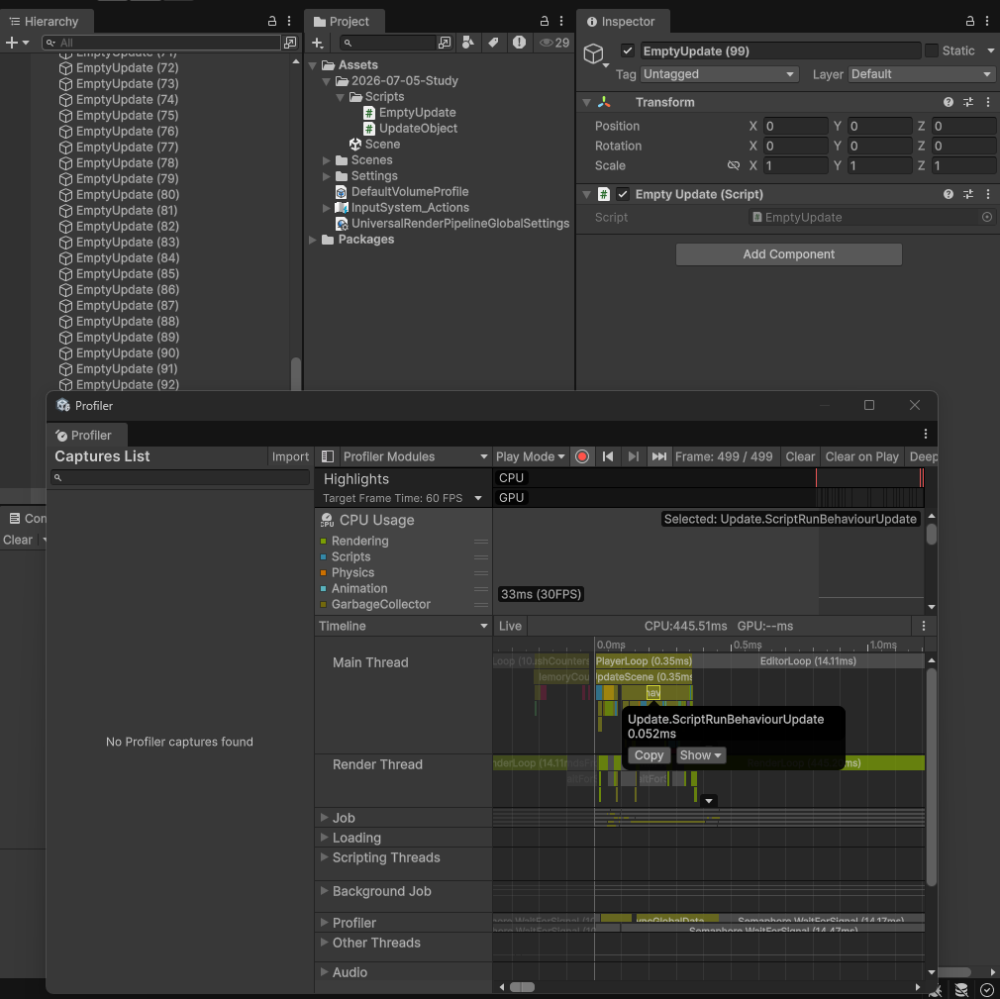
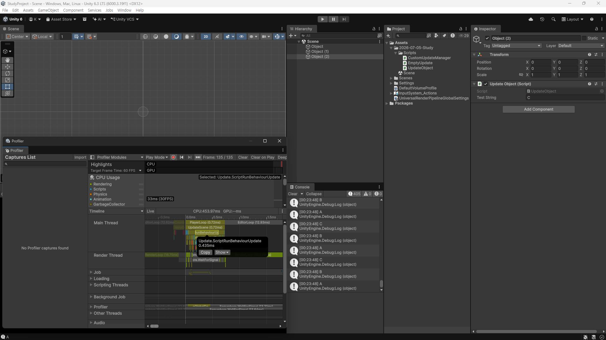
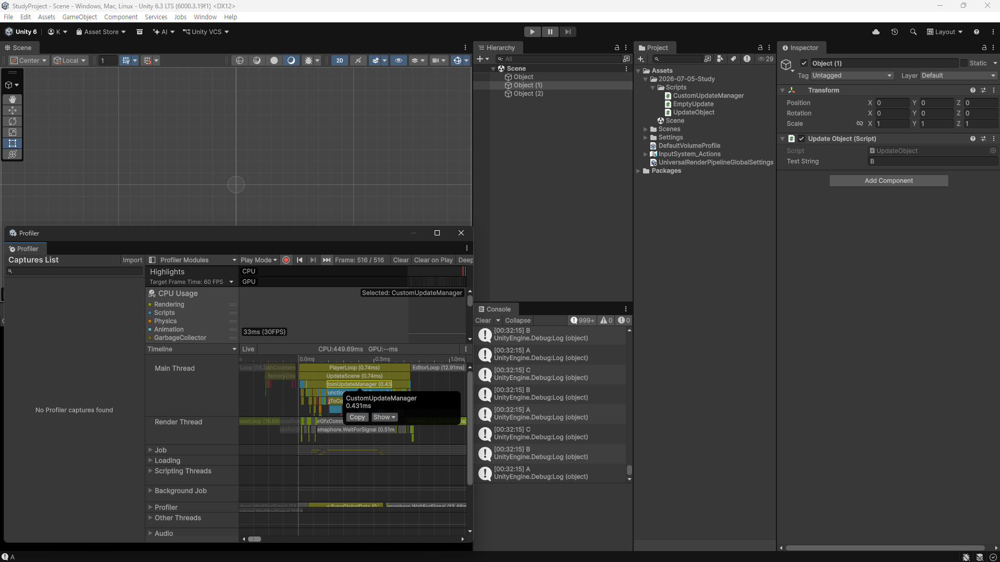
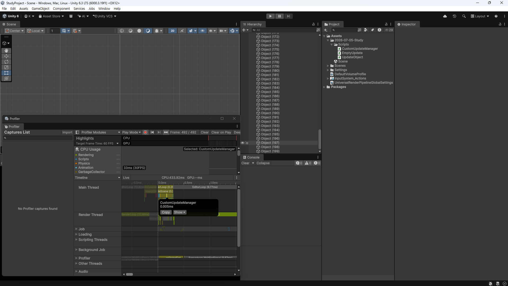
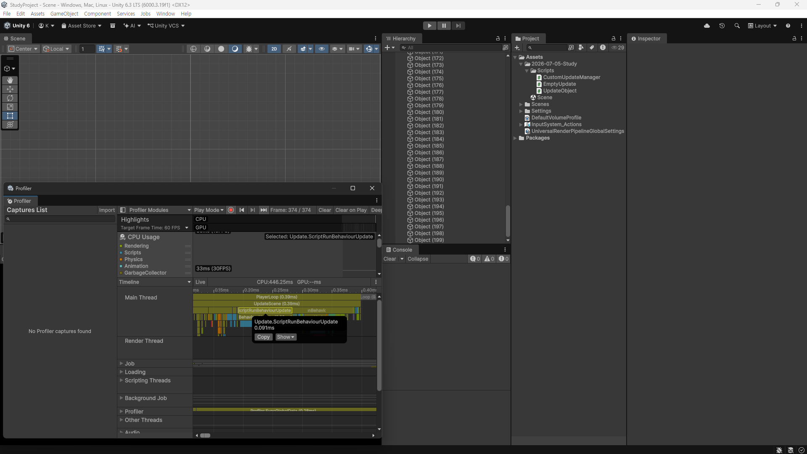

유니티의 패턴중에는 이러한 패턴이 있다
{{card: https://docs.unity3d.com/6000.4/Documentation/Manual/events-per-frame-optimization.html}}

이를 이해하기 위해서는 게임 엔진에 대한 지식이 필요하다

보통 게임 엔진의 경우 cpp 언어로 작성이 주로 되고, opengl, drectX, vulcan 등 그래픽스 api를 사용하여 제작된다. 이러한 엔진들이 하는것은 무엇인가?

둠은 맞는 예시는 아니다만, 보통 게임 엔진들은 아래와 같은 형태를 띈다
```
초기화 (윈도우 생성, 리소스 로드 ...)
while (게임이 실행 중)
{
    입력 처리      (Input)   - 키보드/마우스/패드
    상태 갱신      (Update)  - 게임 로직, 물리, AI
    화면 렌더링    (Render)  - 그래픽스 API로 그리기
}
```

유니티의 경우는 아래와 같다
```
프레임 시작
 → 입력 처리
 → 물리 계산 (FixedUpdate)
 → 스크립트 Update
 → 애니메이션
 → 렌더링
프레임 끝  → 다시 처음으로
```

이때 보통 게임 엔진 내부의 스크립트들이 다시 작동하게 되는데 이때 매 프레임마다 엔진과 스크립팅 런타임, 다른말로는 native(엔진 코어)와 managed(엔진 내부에서 작성된 스크립트들)가 서로 정보를 주고 받게 된다.

>유니티의 경우 => 엔진 루프(C++)  ──매 프레임, cs마다──►  MonoBehaviour.Update() (C#)

이때 서로 소통과정에서 어쩔 수 없는 오버헤드가 발생하게 되고, 이는 성능의 여부를 가르게 된다.

유니티의 경우는 시작할때 각 .cs들이 update를 가지고 있는지 확인 후, 리스트에 넣고 이를 순회하여 사용하는 방식을 취하고 있다. 이때 빈 update, 혹은 별 기능이 없더라도 리스트에 넣게 되고, 만약 이 숫자가 많아지게 될시, 자원이 낭비되는 결과를 야기할 수 있다.

유니티로 예시를 들면, A, B, C라는 스크립트가 있고, 각각 update를 가지고 있다. 이러한 프로젝트를 빌드할 시, 엔진은 리스트에 이 3개의 스크립트를 리스트에 넣고, 이후 매 프레임 해당 부분을 실행하게 된다. 이를 최적화 하는 방법은 뭐가 있을까?

이에 대한 한가지 대답으로 아래와 같은 패턴이 생겼다
>**Custom Update Manager**
각 cs들은 Tick이라는 부분에 update에 해당하는 부분을 작성 한 뒤, 이를 전역 update manager가 받아서 처리하는 방식으로 수정하는 것이다.

이렇게 하게되면 오버헤드는 논리적으로 매 프레임 1번만 일어나기에, 최적화를 이루어 낼 수 있다고 할 수 있다.

예시로 실제 프로젝트로 테스트 해보자

한 씬에서 3개의 오브젝트가 있다.

각 오브젝트는 아래와 같은 스크립트를 각자 가지고 있다
```
using UnityEngine;

public class UpdateObject : MonoBehaviour
{
    [SerializeField]
    private string _testString;
    
    void Update()
    {
        Debug.Log(_testString);
    }
}
```

각 오브젝트는 지정된 string을 debug로 표시한다


이와 같은 결과를 확인할 수 있다.

이 결과로 아래와 같은것을 알 수 있다.
**1. 사용자가 원하는 순서로 update를 실행하지 못하고 있다.**
사용자가 A => B => C 순서로 실행을 원하더라도, 엔진 내부에서 순서를 임의로 결정하기에 이를 선택하지 못한다.

다만 이는 유니티 엔진의 Script Execution Order 세팅으로 강제 조정이 가능하지만, cs단위의 order조절이기에 같은 스크립트 내부 문제인 본 상황에는 적용할 수 없다.

**2. 각 스크립트가 엔진과 통신에서 오버헤드가 일어난다**
각각의 오브젝트가 전부 update를 가지기에, 3번의 경계간 호출이 필요하다


또한 이런 빈 update 스크립트를 작성해서
```
using UnityEngine;

public class EmptyUpdate : MonoBehaviour
{
    void Update()
    {
        
    }
}
```
우선 아무것도 없는 씬을 분석하면

프로파일러에서 ScriptRunBehaviourUpdate가 대충 0.010ms정도 나오는 것을 확인할 수 있다.
이때 빈 update객체를 엄청 만들어서 시간을 찍어보면?

ScriptRunBehaviourUpdate가 0.050ms정도로 늘어난 것을 확인할 수 있다.

이것으로 새로운 사실을 검증할 수 있다.

**3. 빈 update()도 무조건 호출된다**
할 일이 없어도 호출이 일어나는것은 낭비이지만, 이를 관리하는 것은 엔진이기에, 이를 관리하느 것은 불가능 하다.

추가적으로
**4. 순수 C# 객체는 update를 가질 수 없다**
update는 monobehaviour의 메서드이기에, 일반 C# 클래스는 프레임 업데이트를 받는 것이 불가능하다.


그래서 이를 해결 하는 방법으로 CustomUpdateManager를 만들어, 이를 관리하는 방법이 있다.

핵심은, 각 object들이 update를 직접 하는 것이 아닌, 이를 전담하는 쪽에다가 전달 하고, 전담하는 객체가 이를 받아 처리하여 오버헤드를 줄이는 것이다.


```
using System.Collections.Generic;
using UnityEngine;
using UnityEngine.LowLevel;
using UnityEngine.PlayerLoop;

public interface ITickable
{
    void Tick();
}

public static class CustomUpdateManager
{
    private static readonly List<ITickable> _tickables = new List<ITickable>();

    public static void Register(ITickable t)   { if (!_tickables.Contains(t)) _tickables.Add(t); }
    public static void Unregister(ITickable t) => _tickables.Remove(t);

    private static void Tick()
    {
        for (int i = 0; i < _tickables.Count; i++)
            _tickables[i].Tick();
    }

    // 게임 시작 시 PlayerLoop에 커스텀 시스템 삽입
    [RuntimeInitializeOnLoadMethod(RuntimeInitializeLoadType.BeforeSceneLoad)]
    private static void Install()
    {
        var loop = PlayerLoop.GetCurrentPlayerLoop();

        var customSystem = new PlayerLoopSystem
        {
            type = typeof(CustomUpdateManager),
            updateDelegate = Tick   // 매 프레임 호출될 델리게이트
        };

        // Update 단계 안에 시스템을 추가
        for (int i = 0; i < loop.subSystemList.Length; i++)
        {
            if (loop.subSystemList[i].type == typeof(Update))
            {
                var subs = new List<PlayerLoopSystem>(loop.subSystemList[i].subSystemList);
                subs.Add(customSystem);
                loop.subSystemList[i].subSystemList = subs.ToArray();
            }
        }

        PlayerLoop.SetPlayerLoop(loop);
    }
}
```

>**PlayerLoop란 무엇인가?**
Unity가 매 프레임마다 해야 하는것을 데이터로 만들어 둔 것
즉, 매 프레임마다 어떻게 실행되는지 공식적으로 만든 실행 순서표 같은것이다.

>유니티 공식 이벤트 함수의 실행 순서
{{card: https://docs.unity3d.com/kr/2022.3/Manual/ExecutionOrder.html}}

이를 보면 대충 이와 같다

PlayerLoop
├─ Initialization          ← 프레임 맨 앞 준비 작업
├─ EarlyUpdate             ← 입력 이벤트 처리 등
├─ FixedUpdate             ← 물리 (프레임과 별개로 고정 간격)
│   ├─ ScriptRunBehaviourFixedUpdate   → 모든 FixedUpdate() 호출
│   └─ PhysicsFixedUpdate
├─ PreUpdate
├─ Update                  ← "일반적인 매 프레임 로직"
│   ├─ ScriptRunBehaviourUpdate        → 모든 Update() 호출
│   └─ ScriptRunDelayedTasks           → 코루틴 등
├─ PreLateUpdate
│   └─ ScriptRunBehaviourLateUpdate    → 모든 LateUpdate() 호출
└─ PostLateUpdate          → 렌더링, 카메라 등

이때 위의 코드는 이 실행 순서표 = PlayerLoop를 가져와서 Update단계 내부에 Tick이라는 것을 부르라는 칸을 하나 추가한 것이다.

코드에서는 아래가 이와 같은 역할을 한다
```
if (loop.subSystemList[i].type == typeof(Update))
```
만약 update loop 위치가 맞다면

```
var subs = new List<PlayerLoopSystem>(loop.subSystemList[i].subSystemList);
subs.Add(customSystem);
loop.subSystemList[i].subSystemList = subs.ToArray();
```
목록에서 찾아서 이를 등록하는 과정을 거치게 한다

이때 추가는 1. 리스트에 넣고 2. 엔진에 반영하기의 2단계를 거치게 된다
```
var subs = new List<PlayerLoopSystem>(loop.subSystemList[i].subSystemList);
```
loop.subSystemList[i].subSystemList는 기존 엔진에 처리 목록을 담고 있다.
이를 꺼내서 subs에 담아준다

```
subs.Add(customSystem);
```
그리고 여기에 직접 정의한 update를 끼워 넣어준다

```
loop.subSystemList[i].subSystemList = subs.ToArray(); 
```
그 후, 수정한 목록을 사본 loop의 원래 자리에 도로 넣는다

```
PlayerLoop.SetPlayerLoop(loop);      
```
최종적으로 수정한 loop를 엔진단에 반영시킨다


굉장히 귀찮고 돌아가는 방식이다. 왜 이렇게 하는지 의문이 들 수 있다.
가장 큰 문제는, 유니티의 subSystemList는 Array이다. 즉, 크기를 늘릴 수 없다. 그래서 Array를 List로 복사해온 뒤, 추가하고 다시 Array로 반환해서 돌려주는 것이다.

```
1. 원본 배열(subSystemList)을 List(subs)로 복사
2. subs에 customSystem을 추가
3. subs.ToArray()로 다시 배열로 바꿔 원래 자리에 대입
```

이제 얼마나 최적화가 되는지 확인해 보자


기존의 string debug를 사용하는 경우 0.435ms의 시간이 나왔다. 이를 CustomUpdateManager를 거치게 해보자

```
using UnityEngine;

public class UpdateObject : MonoBehaviour, ITickable
{
    [SerializeField]
    private string _testString;

    void OnEnable()
    {
        CustomUpdateManager.Register(this);
    }
    void OnDisable()
    {
        CustomUpdateManager.Unregister(this);
    }

    public void Tick()
    {
        Debug.Log(_testString);
    }
}
```
기존에 debug를 찍던 오브젝트를 ITickable을 거치도록 수정한다


엄.. 차이가 그렇게 나지 않는것을 확인할 수 있다. 이는 공식 문서에서로 나타나있듯, 경계를 숫자가 많아야 의미가 생기는데, 3번 정도로는 0에 수렴할 정도로 차이가 없어서 그렇다.

좀 더 확인을 명확하게 하기 위해서 오브젝트 수를 200개로 늘리고 가벼운 연산을 수정한다


>CustomUpdateManager 사용
```
using UnityEngine;

public class UpdateObject : MonoBehaviour, ITickable
{
    void OnEnable()
    {
        CustomUpdateManager.Register(this);
    }
    void OnDisable()
    {
        CustomUpdateManager.Unregister(this);
    }

    private float _v;
    public void Tick() { _v += 1f; } 
}
```
**0.004ms 사용(0.001ms는 기본비용)**
<br>


>Update 사용
```
using UnityEngine;

public class UpdateObject : MonoBehaviour//, ITickable
{
    // void OnEnable()
    // {
    //     CustomUpdateManager.Register(this);
    // }
    // void OnDisable()
    // {
    //     CustomUpdateManager.Unregister(this);
    // }

    private float _v;
    public void Update() { _v += 1f; } 
}
```
**0.081ms 사용(0.010ms는 기본 비용)**

많은 절약이 된 것이 확인된다. 이러한 방식으로 오버헤드를 줄일 수 있음을 확인할 수 있다.


# 마무리
CustomUpdateManager는 단순하게 자원 절약만을 위한 패턴은 아니다. 글 초반에서 제시한 4가지 점만 봐도 자원에 대한 부분 이외의 것도 있다. 즉, 오버헤드 감소는 해당 패턴의 이점 중 하나일 뿐이다.

핵심은 업데이트의 흐름을 직접 통제할 수 있다는 것이다. 현재는 흐름 통제까지 반영을 하지 않았지만, lowlevel부분까지 내려가 수정을 하면 순서 또한 통제할 수 있음을 이해해주길 바란다.

또한, 해당 패턴은 만능이 아니다. 공식 문서에서도 이를 못 박아두고 있다. 오브젝트 숫자가 적을때도 그러하고, 시간 자원 자체는 의미가 크게 없는 경우가 많을 수 있다. 또한, 엔진이 관리해주던 부분을 억지로 뜯어와 직접 관리해야 하는 부분도 생긴다(Register/Unregister를 빼먹으면 아예 동작하지 않는다 — 실제로 이 글을 쓰며 한 번 겪었다).

언제나 득실이 있음을 이해하고 지식을 탐구하면 좋다.

### 잡담
이후 통제기능까지 추가해서 글을 수정해보면 재미 있을 것 같다.

>사용된 유니티 프로젝트 Github link
{{card: https://github.com/NoNamed02/UnityStudyProject}}