**프로파일링 = profiling이란?**
프로그램의 다양한 수치를 수집하고 분석하는 과정

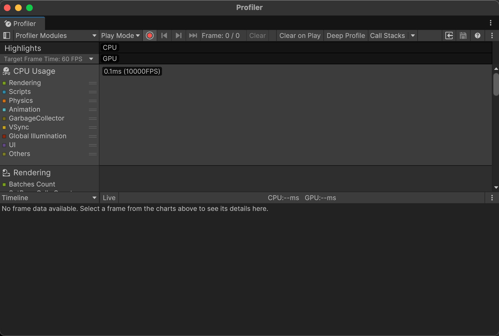
유니티의 프로파일러이다 해당 창을 통하여 개발자들은 자신이 만든 게임의 어떠한 부분들이 성능에 부하를 받고 있는지 확인할 수 있다.

해당 창은 아래의 4가지 구성으로 이루어져 있다.

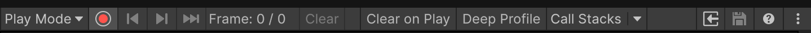

1. **프로파일러 컨트롤**
프로파일링 대상을 선택하고 프라포일링을 시작하거나 중지하는 등의 상호작용이 가능

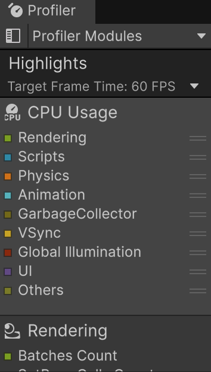

2. **프로파일러 모듈**
프로파일링이 가능한 모듈의 목록이 표시됨

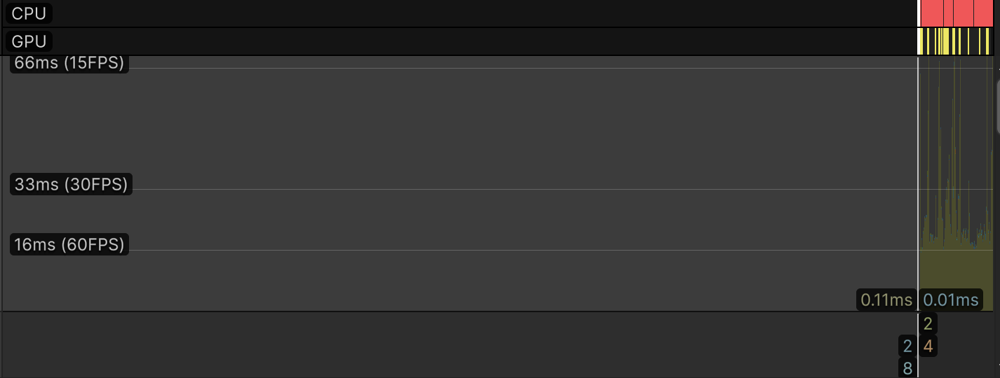

3. **프레임 차트**
현재 활성화된 각 프로파일러 모듈의 차트가 이 영역에 그려짐

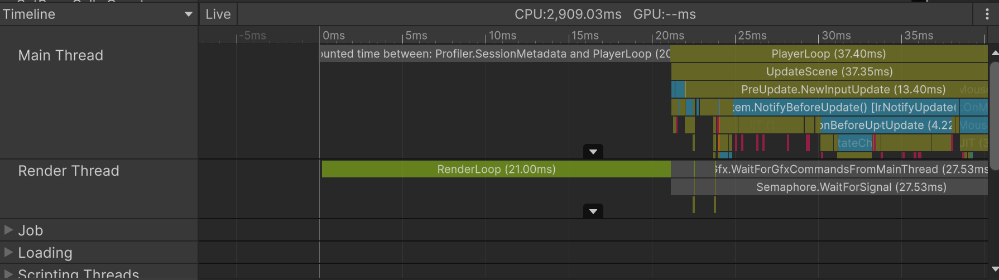

4. **모듈 세부 정보 창**
현재 선택한 프로파일러 모듈에 기록된 상세 정보가 표시됨

### 프로파일러 부착
프로파일링을 수행하기 위해서는 프로파일러를 원하는 대상에 부착하는 과정을 거쳐야 한다.

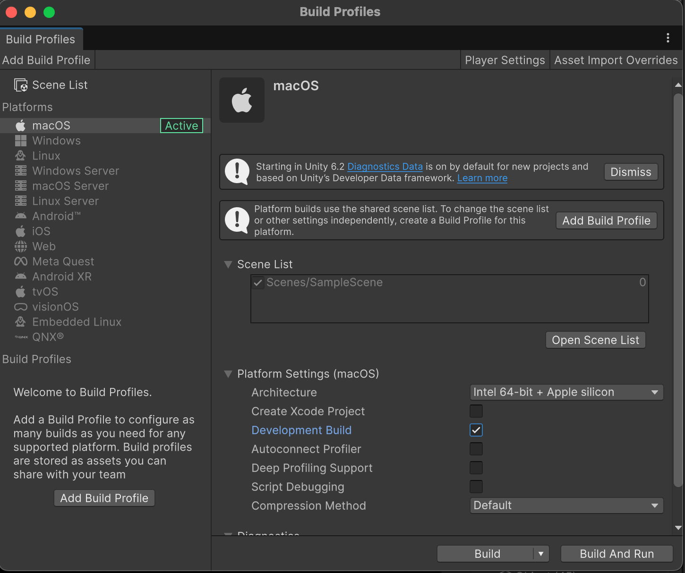
이때 빌드된 유니티 플레이어(유니티 빌드 앱을 유니티 플레이어라 부름)에 프로파일러를 부착하려면 개발용 빌드 설정으로 빌드를 해야한다.

이때 빌드에 여러가지 옵션이 있다.

1. **프로파일러 자동 연결(Autoconnect Profiler)**
해당 옵션을 활성화 하면 빌드된 플레이어가 실행될때 자동으로 유니티 프로파일러가 부착된다. 해당 기능은 빌드 과정에서 기기의 IP를 빌드에 포함시키는 방식으로 작동하기에, 빌드를 수행한 기기와 프로파일러가 실행되는 기기가 같을때만 작동한다.
(WebGL의 경우 빌드가 에디터에서 탐색이 불가능 하기 때문에, 해당 기능을 적극 활용해야 한다)

2. **딥 프로파일링(Deep Profiling Support)**
기본 상태의 프로파일러는 주요 코드 블록 단위로 샘플을 기록한다. 해당 기능을 활성화 할시 실행중 모든 C# 함수 호출을 기록한다.
겉으로 보기에는 매우 좋은 기능처럼 보이지만, 성능 부하가 매우 커서 프로파일링 자체로 인한 성능 오버헤드로 인해 측정된 시간의 신뢰도가 낮아지기에 대부분의 상황에 사용하지 않는다.
굳이 사용하자면, 함수의 호출 구조를 확인할때 제한적으로 사용된다.

>**오버헤드(Overhead)**
의도하지 않은 추가적 성능 비용

프로파일링할 대상은 프로파일러 창에서 Attach to Player 버튼을 눌러 확인, 변경이 가능하다.
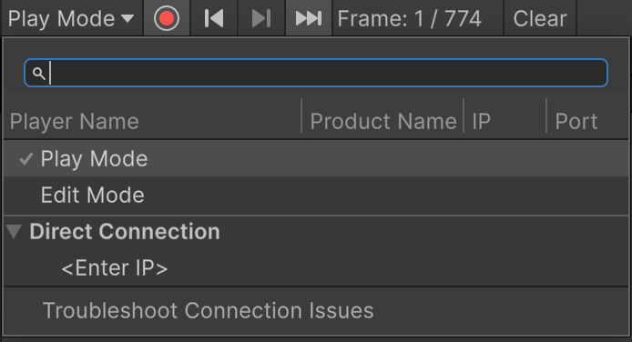
현재 해당 PC에 빌드된 프로젝트가 없어서 표시가 안되는데, 빌드된 프로젝트가 인식되면 해당 창에 실행 파일명이 표시되며, 이를 눌러 부착이 가능하다.

부착이 가능한 플레이어 = 빌드의 종류는 아래와 같다

1. **Play Mode**
유니티 에디터에서 플레이 모드로 실행 중인 상태
2. **Edit Mode**
유니티 에디터가 플레이 모드가 아닌 에디터 모드 상태
3. **Local**
로컬 머신 또는 케이블로 직접 연결된 기기에서 실행중인 플레이어
4. **Remote**
동일한 네트워크 환경에 연결된 원격 기기에서 실행 중인 플레이어
5. **Connections Without ID**
유니티 2021.2 이전 버전으로 빌드되에 제품 이름 속성을 포함하지 않는 플레이어
6. **Direct Connection**
플레이어의 IP 주소를 수동으로 입력해 직접 연결하는 방식

각 플레이어 대해서는 아래의 정보가 표시된다.
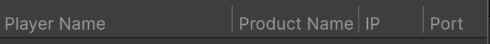

- **Player Name**
실행 중인 기기 또는 실행 파일명이 표시됨
- **Product Name**
유니티 프로젝트 설정에서 지정한 제품평이 표시됨

### 에디터 프로파일링
에디터 프로파일링은 편리하지만 아래와 같인 이유로 정확도가 낮다.

1. **빌드 시 적용되는 최적화가 반영되지 않음**
2. **디버그 코드와 에디터 코드가 함께 포함됨**
3. **에디터 전용 오브젝트가 모두 메모리에 로드됨**

단, 에디터 자체 혹은 커스텀 툴의 성능은 해당 프로파일러를 사용한다.
이때 애디터 환경에서 실제 기기와 가까운 환경을 만들려면 아래와 같은 환경을 만들기를 권장한다.
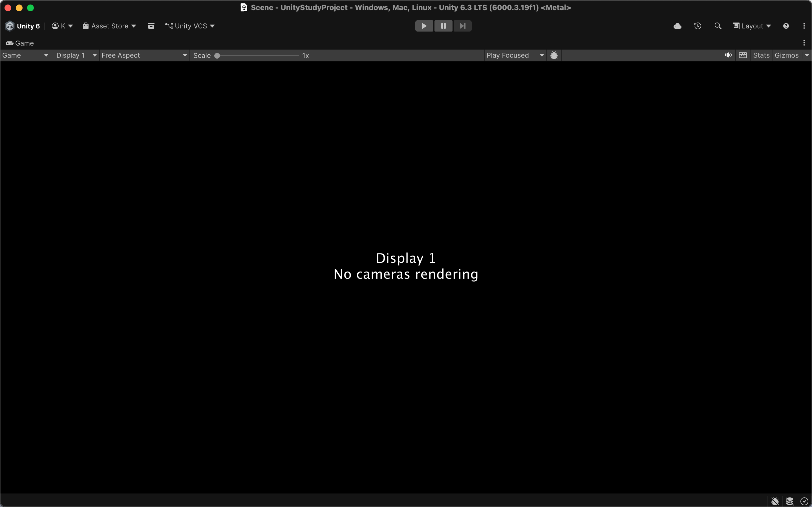

- **불필요한 에디터 창을 모두 닫는다**
- **게임 창을 Play Maximized로 설정한다**


프로파일러 창에서는 하얀색 선 = 프레임 인디케이터를 움직여 원하는 프레임에서 부하를 확인할 수 있다.

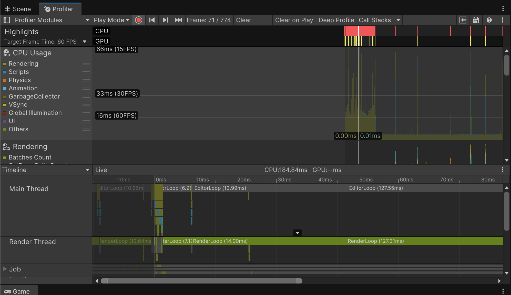
이때 프로파일러 컨트롤을 이용하여 1프레임씩 버튼을 통해서 이동하는 것도 가능하다.

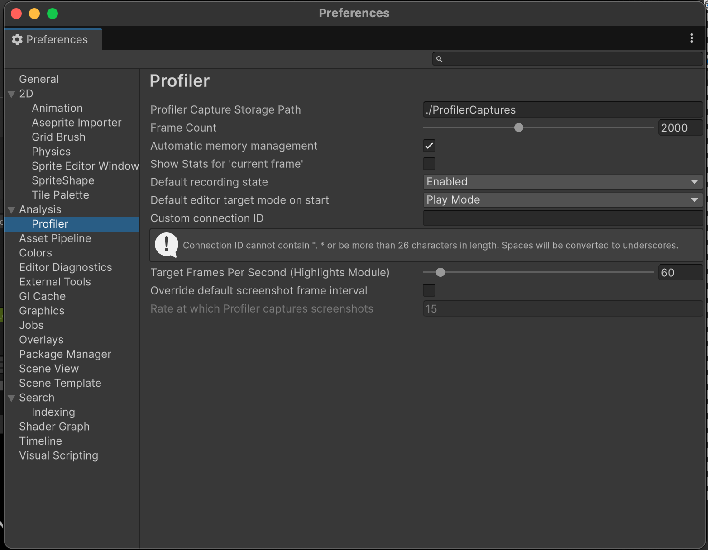
기본 설정 기준으로 프로파일러는 최근 300프레임의 데이터를 유지한다(라고 책에 적혀있는데, 본인은 2000프레임이 기본값이였다). 해당 설정은 Preferences => Profiler의 Frame Count에서 수정이 가능하다.

프레임 카운터가 클수록 프로파일러가 유지해야 하는 데이터의 양이 늘어나고, 이로 인해서 오버헤드가 발생할 가능성이 높아지기에 설정에 주의가 필요하다.

## 프로파일러 모듈
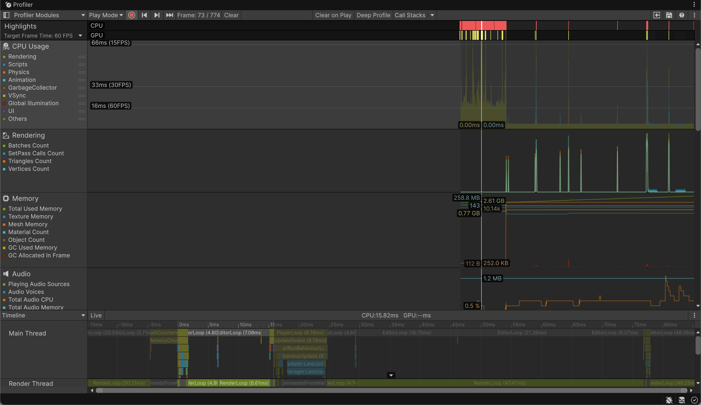
현재 활성화된 프로파일러 모듈은 프로파일러창 왼쪽 패널에서 확인할 수 있다.

<div class="img-row">
  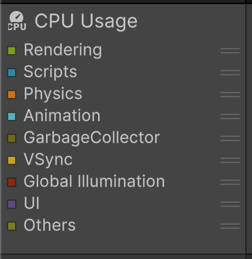
  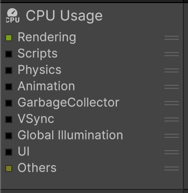
</div>
모듈 목록에서 원하는 모듈을 클릭하는 것으로 창에서 보이는 정보를 제한하여 확인할 수 있다.

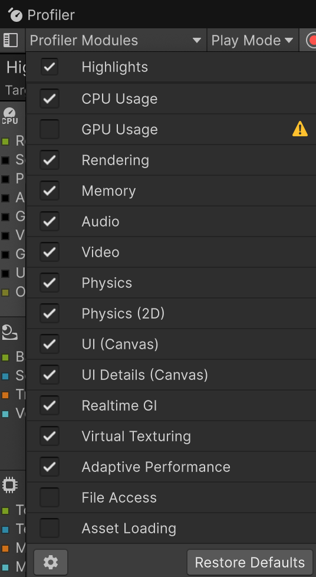
이때 모듈의 구성은 Profile Modules 버튼을 눌러서 변경할 수 있다.

많은 모듈을 활성화 할시 매 프레임마다 수집할 정보가 늘어나 오버헤드가 생길 수 있기에, 프로파일링시 필요한 모듈만 활성화 해두는 것이 좋다.

## CPU 모듈
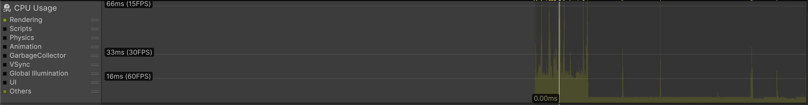
CPU 모듈은 애플레케이션의 각 기능이 CPU 시간을 얼마나 사용했는지 보여준다. CPU의 사용시간은 프레임레이트와 직결되기에 자주 확인해야 하는 모듈이다.

CPU 모듈은 다음과 같은 카테고리가 포함되어 있다.

- **Rendering**
그래픽스 렌더링에 소요되는 CPU 실행시간
- **Scripting**
C# 스크립트 실행에 사용되는 CPU 시간
- **Physics**
물리 연산을 처리하는 데 사용된 CPU 시간
- **Animation**
애니메이션 계산과 처리에 소요된 CPU 시간
- **GarbageCollector**
GC가 실행되는 시간 사용된 CPU 시간
- **VSync**
프레임 동기화를 위해 대기한 CPU 시간
- **Global Illumination**
조명 계산에 사용된 CPU 시간
- **Others**
에디터 루프나 프로파일러 자체 처리 등 기타 작업에 사용된 CPU 시간

## 샘플
CPU 프로파일러는 샘플 단위로 데이터를 기록한다.

>**샘플(Sample)**
CPU 실행 시간이 저장된 프로파일링 데이터

샘플은 아래의 실행 구간에서 생성된다

- 프로파일러 마커가 지정된 C# 메서드와 코드블록
- 유니티 엔진에서 CPU 시간을 사용하는 주요 기능

### 샘플링 범위
기본적으로 유니티 프로파일러는 모든 C# 메서드를 샘플링하지 않으며, 프로파일러 마커가 지정된 주요 메서드, 코드 블록, 엔진 기능 단위에서만 샘플을 생성한다.

만약 모든 C# 메서드를 샘플링하려면 위에서 언급한데로 딥 프로파일링을 사용해야 한다.

```
using System.Collections.Generic;
using UnityEngine;

public class TestVectorUpdate : MonoBehaviour
{
    private List<Vector3> _points;
    void Update()
    {
        _points.Clear();
        for (var i = 0; i < 1000; i++)
        {
            var x = Random.Range(-100, 100);
            var y = Random.Range(-100, 100);
            var z = Random.Range(-100, 100);
            _points.Add(new Vector3(x, y, z));
        }
    }
}
```

확인을 위해 해당 스크립트를 사용한다
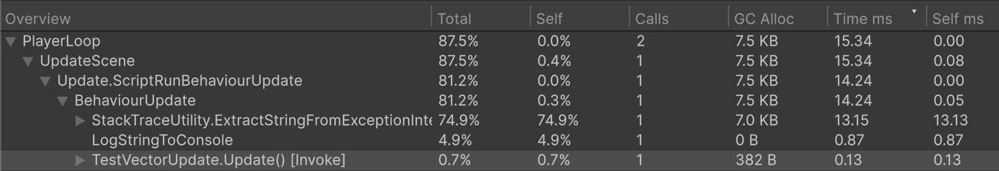
일반 프로파일러를 사용할시 0.13ms가 나옴을 확인할 수 있다(현재 macbook air 2018을 사용중이라 하드웨어 성능이 매우 나빠 기본적으로 CPU 시간이 많이 나오고 있다. 일반적인 시간은 아님을 인지해주길 바란다)
이때 Update() 자체의 시간을 분석함을 알 수 있다.

이를 딥 프로파일링으로 볼시 어떻게 보이는가?
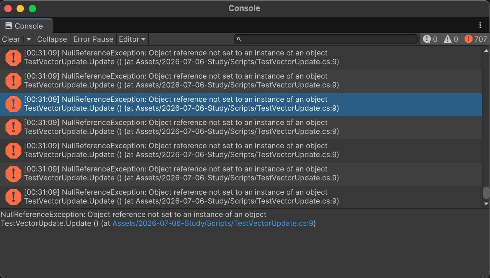
??????
코드가 잘못되었다, 뭐가 잘못된거지

```
using System.Collections.Generic;
using UnityEngine;

public class TestVectorUpdate : MonoBehaviour
{
    private List<Vector3> _points = new List<Vector3>();
    void Update()
    {
        _points.Clear();
        for (var i = 0; i < 1000; i++)
        {
            var x = Random.Range(-100, 100);
            var y = Random.Range(-100, 100);
            var z = Random.Range(-100, 100);
            _points.Add(new Vector3(x, y, z));
        }
    }
}
```
List 초기화를 하지 않고 사용했다, 당연히 될리가 없지

<div class="img-row">
  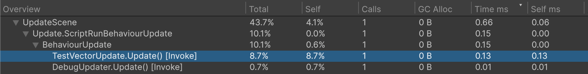
  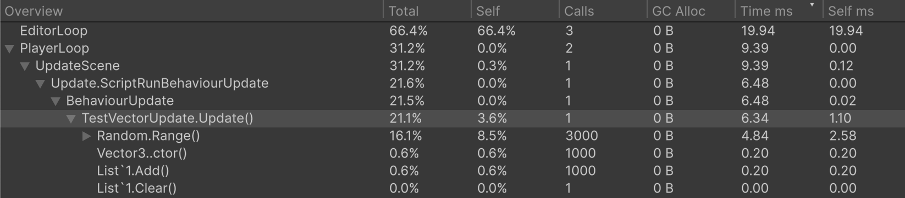
</div>
다시 측정한 결과이다. 확실히 CPU 시간 차이가 나는 것을 확인 가능하다. 이때 눈여겨 볼 것은 딥 프로파일링의 경우 update 내부의 add, random range 등을 모두 기록하게 되면서 오버헤드가 발생됨을 알 수 있다.

### 샘플 스택
CPU 프로파일러에서 샘플은 콜 스택과 비슷한 계층 구조인 스택 형태로 표시되지만, 실제로 콜 스택과 동일한 구조는 아님.

### 프로파일러 마커
프로파일링할 코드 블록을 표시하는데 사용된다. 마커가 지정된 구간이 실행되면 해당 구간의 CPU 실행 시간이 CPU 프로파일러에 샘플로 기록된다.

코드에서 마커를 표시하기 위해서는 ProfilerMarker 객체를 생성후, .Begin(), .End()로 샘플링을 할 수 있다.

```
using System.Collections.Generic;
using Unity.Profiling;
using UnityEngine;

public class TestVectorUpdate : MonoBehaviour
{
    private ProfilerMarker marker = new ProfilerMarker("Test Loop");
    private List<Vector3> _points = new List<Vector3>();
    void Update()
    {
        _points.Clear();

        marker.Begin();
        for (var i = 0; i < 1000; i++)
        {
            var x = Random.Range(-100, 100);
            var y = Random.Range(-100, 100);
            var z = Random.Range(-100, 100);
            _points.Add(new Vector3(x, y, z));
        }
        marker.End();
        for (var i = 0; i < 1000; i++)
        {
            _points.RemoveAt(0);
        }
    }
}
```

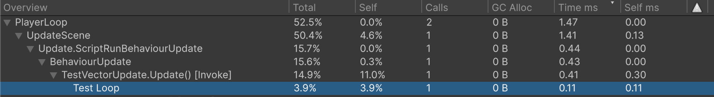
따로 표시가 되는것을 확인할 수 있다. 유니티가 기본적으로 마커를 제공하지 않는 경우, 딥 프로파일링을 사용하는 것 보다 이렇게 마커를 사용하는것이 더욱 가볍고 정확하기에 권장된다.

이외에 using을 이용해서도 마커를 사용할 수 있다.

```
using System.Collections.Generic;
using Unity.Profiling;
using UnityEngine;

public class TestVectorUpdate : MonoBehaviour
{
    private ProfilerMarker marker = new ProfilerMarker("Test Loop");
    private List<Vector3> _points = new List<Vector3>();
    void Update()
    {
        _points.Clear();

        using(marker.Auto())
        {
            for (var i = 0; i < 1000; i++)
            {
                var x = Random.Range(-100, 100);
                var y = Random.Range(-100, 100);
                var z = Random.Range(-100, 100);
                _points.Add(new Vector3(x, y, z));
            }
        }
        for (var i = 0; i < 1000; i++)
        {
            _points.RemoveAt(0);
        }
    }
}
```

### 기본 프로파일러 마커
아래의 마커들은 CPU 프로파일러에서 자주 확인하게 되는 마커들이다.

1. **메인루프**
- **PlayerLoop**
플레이어 루프에서 실행되는 모든 처리의 루트 마커. Update, Lateupdate 등 런타임 중 실행되는 주요 처리가 이 아래에 포함된다.
- **EditorLoop**
에디터 전용 루프의 루트 마커. 에디터 창 갱신과 같은 에디터 관련 처리가 이 아래에 포함된다.

2. **스크립트 업데이트**
- **BehaviourUpdate**
Update 메서드에서 실행되는 스크립트 샘플들을 하나로 묶은 마커
- **FixedBehaviourUpdate**
FixedUpdate 메서드에서 실행되는 스크립트 샘플들을 하나로 묶은 마커

3. **렌더링**
- **WaitForTargetFPS**
Application.targetFrameRate 또는 VSync 설정에 의해 프레임을 대기하는 시간
- **Gfx.PresentFrame**
GPU가 현재 프레임을 화면에 표시할 때까지 CPU가 대기한 시간. VSync로 인한 대기 시간도 이 항목에 포함된다
- **Gfx.WaitForCommands**
렌더 스레드가 새 렌더링 명령을 기다리고 있는 상태. 이 샘플이 길게 관측되면 CPU 메인 스레드에서 병목 가능성이 높아짐
- **Gfx.WaitForPresentOnGfxThread**
렌더 스레드가 GPU의 프레임 표시 작업을 기다리고 있는 상태. 이로 인해 메인 스레드까지 함께 대기하고 있다면 GPU 병목을 의심할 수 있음

4. **가비지 컬렉션**
- **GC.Alloc**
관리되는 힙에 대한 동적 할당을 의미함. 일반적으로 C#에서 발생하는 동적 메모리 할당으로 이해할 수 있음.
- **GC.Collect**
GC가 실행되었음을 나타냄. 점진적 GC를 활성화한 상태에서는 GC가 한 프레임에서 모두 실행되지 않고 여러 프레임에 나누어 실행될 수 있음

>**점진적 GC**
기존 GC = Boehm GC는 실행될시 모든 작업을 한번에 처리하기 위해서 게임 로직을 멈춘 뒤, 정리하는 과정을 거치게 되는데, 이때 게임이 잠시 멈추는 스파이크 현상 같은 부작용이 있을 수 있있다. 그렇기에 점진적 GC는 해당 작업을 몇개로 나누어 여러 프레임으로 진행하여 한 프레임에 부하를 적게주는 방식으로 바꾼 것이다. 다만, 전체 GC 시간이 늘어날 수 있다(나누는 과정에서 오버헤드 발생 가능).

### GC.Alloc 마커
GC.Alloc 마커는 C# 코드에서 발생한 동적 메모리 할당을 의미한다.

```
void Update()
{
    var points = new List<Vector3>();

    object boxed = new Vector3(1, 2, 3);

    string s = "frame " + Time.frameCount;

    var arr = new float[1000];
}
```
의도적으로 heep에 정보를 할당한다

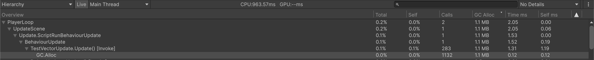

동적 할당은 이후 무조건 GC의 대상이 되기 때문에 GC로 인한 성능 문제를 줄이기 위해서는 GC.Alloc으로 표시되는 동적 할당을 가능 한 줄여야 한다.

해당 마커를 이용하면 동적 할당이 언제, 얼마나 자주 일어나는지, 할당 크기가 어느 정도인지 파악할 수 있다.

GC로 인한 성능 문제를 진단하려면 이하의 순서가 추천된다.
1. **GC.Collect 마커를 통해 실제 GC 실행 시점을 확인한다**
2. **해당 프레임 직전 GC.Alloc마커의 발생 빈도와 할당 크기를 확인한다**

>**GC.Alloc의 실행 시간은 실제 메모리 할당에 소요된 시간보다 훨씬 짧게 표시된다**
이는 유니티가 프로파일링 오버헤드를 줄이기 위해서 할당 발생 시점, 크기만 기록하기 때문이다.