CPU 모듈 차트에는 메인 스레드 CPU 사용량이 시간의 흐름에 따라 그래프로 표시되며, 아래의 두 가지 지점에 주목한다.

>**스파이크(Spike)**
CPU 사용량이 짧은 시간 동안 급격히 증가한 지점

>**프레임 예산 초과 지점**
목표 프레임 시간을 초과한 구간

## 스파이크
스파이크는 차트에서 그래프가 급격히 올라가는 구간을 의미함. 해당 프레임에서 CPU 부하가 순간적으로 많이 증가 했음을 나타냄

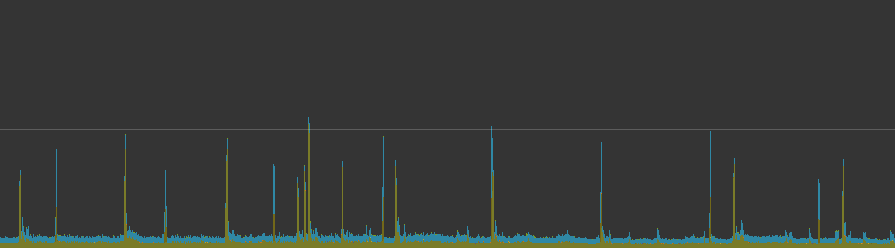
해당 구간들은 게임 화면이 잠시 멈추거나 히칭이 발생할 수 있다.

>**히칭**
프레임이 흔들리는 현상

특히, 프레임 예산을 초과하는 스파이크는 반드시 원인을 확인해야 한다.

## 평균 CPU 사용 시간
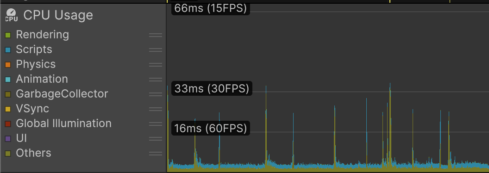
프로파일러 UI를 확인하면 가로 방향으로 선이 보인다. 각 기준선은 아래와 같은 프레임 타임을 의미한다.

- **16ms**
60FPS 기준선
- **33ms**
30FPS 기준선
- **66ms**
15FPS 기준선

목표 프레임을 안정적으로 유지하기 위해서는 CPU 사용 시간이 해당 기준선 아래에 머물러야 한다.

- **주의점**
만약 VSync가 사용되었을시, 해당 카테고리을 비활성화 하고 확인해야 정상적인 차트를 얻을 수 있음

# 모듈 세부 정보 창 툴바
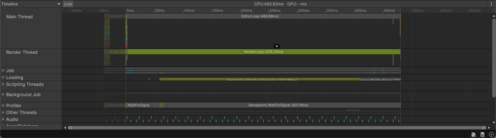
CPU 모듈 세부 정보 창 상단에는 이와 같은 툴바와 버튼이 존재한다.

1. **뷰모드(View Mode)**
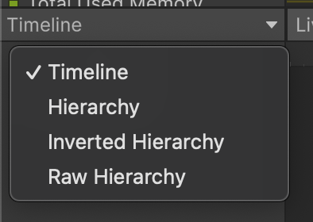
세부 정보 창의 표시 방식을 전환할 수 있다.
- Timeline : 시간 순서를 기준으로 샘플을 표시한다
- Hierarchy : 샘플을 계층 구조 형태로 표시한다
- Raw Hierarchy : 필터를 적용하지 않은 전체 계층 구조를 표시한다

2. **Live 버튼**
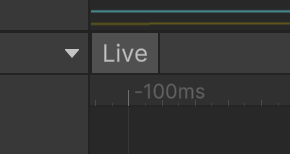
녹화 중 세부 데이터를 실시간으로 표시한다. 유니티 에디터를 대상으로 할때만 사용할 수 있다. 단, 녹화 비용에 따른 오버헤드가 발생한다

3. **CPU/GPU 시간**
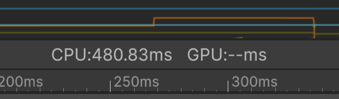
현재 선택된 프레임에서의 CPU와 GPU 소요 시간을 표시한다.

4. **More Items**
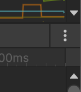
추가 설명 메뉴를 표시한다.


## 타임라인 뷰
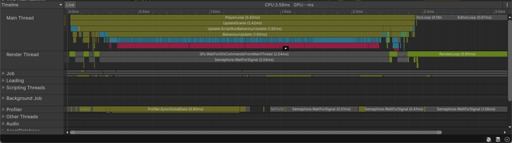
타임라인 뷰에서 샘플을 클릭하면 팝업에서 이하의 정보를 확인할 수 있다.

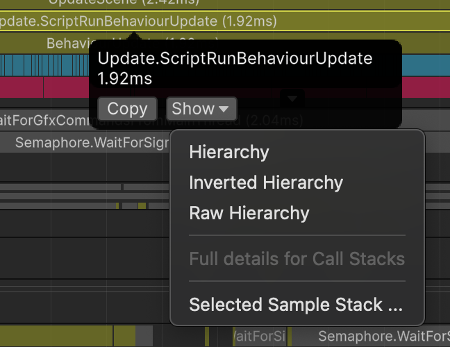
- 해당 샘플에서 사용된 CPU 실행 시간
- 현재 프레임 내에서 동일한 샘플들이 사용한 CPU 실행 시간의 총합
- Copy = 표시된 정보를 텍스트 형태로 복사
- Show = Hierarchy, Raw Hierarchy와 같은 다른 뷰로 이동해 해당 햄플을 확인

타임라인 뷰는 이하의 장점을 가진다

- **함수 CPU 사용 시간 파악의 직관성**
타임라인 뷰를 보면 현재 프레임에서 실행되는 함수 중에서 가장 시간을 많이 소모하는 함수를 시각적으로 빠르게 파악 가능

- **모든 스레드를 한눈에 확인 가능**
하이어라키 뷰는 한번에 하나의 스레드만 확인 가능, 타임라인 뷰에서는 메인 스레드, 렌더 스레드, 워크 스레드를 동시 확인 가능

- **실행 순서 추적의 용이성**
함수의 실행 시점과 실행 순서 관계를 직관적으로 파악 가능. 타임라인 뷰에서는 서로 다른 스레드에서 실행되어 직접 호출 관계가 없는 함수 사이의 선형 관계나 의존성도 쉽게 확인이 가능하다.

## 하이어라키 뷰
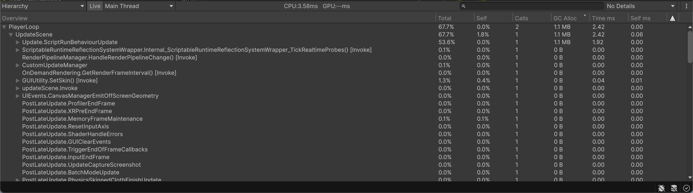
샘플 스택을 계층 목록 형태로 표시한다.

하이어라키 뷰는 함수들 사이의 호출 관계를 보여주며 다음과 같은 지표를 제공한다.

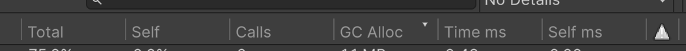
- **Total**
전체 CPU 시간 중 해당 샘플이 차지하는 CPU 시간의 비율
- **Self**
자식 샘플을 제외한 해다 샘플의 순수 실행 비율
- **Calls**
동일한 샘플이 호출된 횟수
- **GC Alloc**
해당 샘플에서 발생한 메모리 할당량
- **Time ms**
해당 샘플이 사용한 전체 CPU 실행 시간
- **Self ms**
자식 호출을 제외한 실제 CPU 실행 시간

하이어라키 뷰에서는 지표를 정렬해 원하는 데이터를 빠르게 확인할 수 있다.

- **Total 또는 Self 기준 내림차순 정렬**
CPU 사용량이 큰 함수를 빠르게 파악 가능
- **GC Alloc 기준 정렬**
메모리 할당이 많이 발생하는 함수를 확인할 수 있음

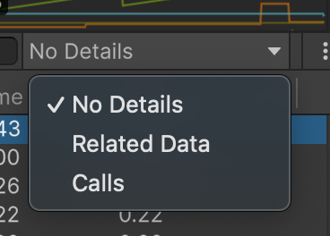
하이어라키 뷰 오른쪽의 드롭다운 버튼을 클릭하면 선택한 샘플에 대한 추가 정보를 확인할 수 있다. 해당 버튼으로 **Related Data**, **Calls** 뷰를 열 수 있다.

1. **Related Data 뷰**
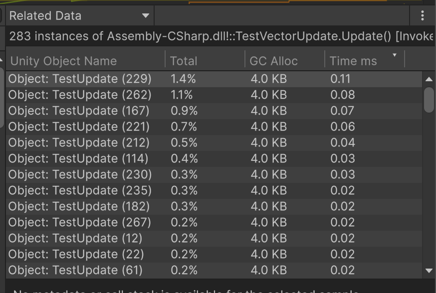
선택한 샘플이 어떤 유니티 오브젝트에서 실행되는지를 보여준다. 또한 오브젝트별로 발생한 메모리 할당량과 CPU 사용 시간을 확인할 수 있다.

2. **Calls 뷰**
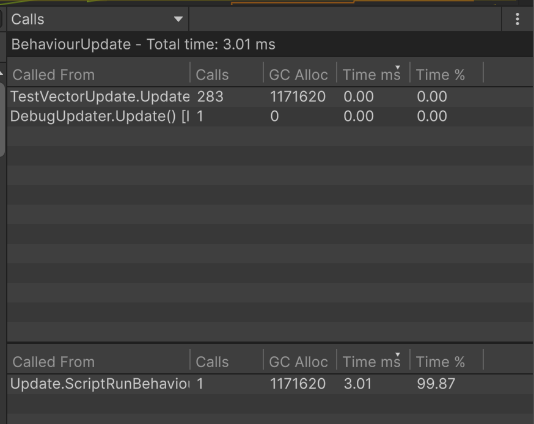
함수 사이의 호출 관계를 보여준다.

```
using UnityEngine;

public class CallA : MonoBehaviour
{
    public CallB CallB;
    void Update()
    {
        CallB.Call();
    }
}

using UnityEngine;

public class CallB : MonoBehaviour
{
    public void Call()
    {
        Debug.Log("Call");
    }
}
```
이렇게 2개의 객체가 있을때

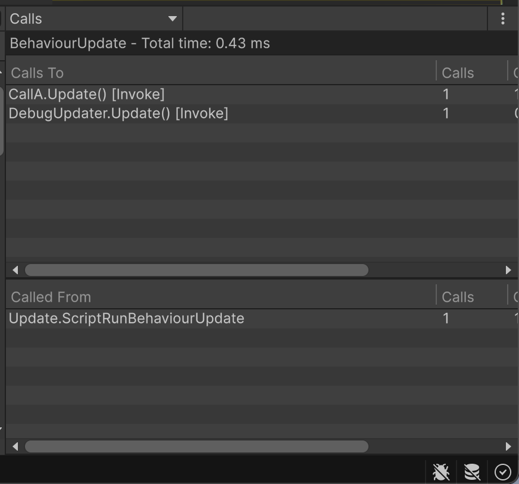

- **Calls To**: 선택한 함수가 호출하는 함수 (callee)
- **Calls From**: 선택한 함수를 호출한 함수 (caller)

로 확인이 가능하다.

## 콜 스택 설정
CPU 프로파일러는 기본적으로 샘플 스택을 표시한다. 하지만 특정 성능 문제의 원인을 더 깊이 추적 할 때는 콜 스택을 함께 기록할 수 있다.

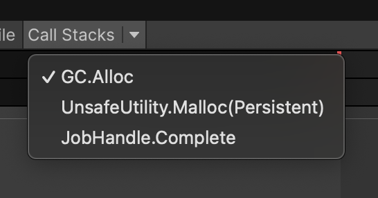
콜 스택 기록을 활성화시 아래와 같은 C#과 네이티브 함수의 전체 호출 경로가 함께 저장된다.

- **GC.Alloc**
동적 할당이 발생한 호출 경로를 기록
- **UnsafeUtility.Malloc**
수동으로 수행한 네이티브 메모리 할당의 호출 경로를 기록
- **JobHandle.Complete**
잡을 동기적으로 완료시키는 호출 경로를 기록

해당 기능은 딥 프로파일링에 비해 적은 오버헤드로 문제 지점을 정확하게 추적할 수 있다는 장점이 있다. 특히 메모리 할당이나 잡 완료 시점의 실행 흐름을 분석하는데 유용하다. 다만, 이 또한 추가 비용이 들기 때문에 항상 사용하기 보다는 특정 구간을 분석할때만 사용하는 것이 좋다.

# 다른 프로파일러 모듈들
## 렌더링 모듈
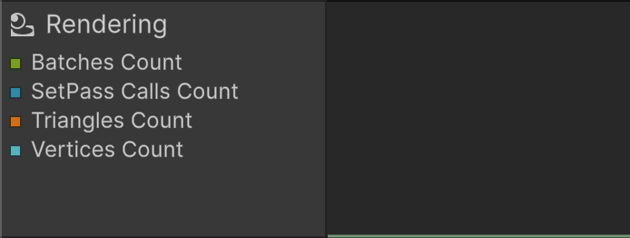
씬을 렌더링하는 과정에서 발생하는 GPU와 CPU 부하를 시각적으로 보여준다. 이 모듈을 통해서 렌더링 부하가 커지는 구간이나 프레임 예산을 초과한 지점을 빠르게 확인할 수 있다.

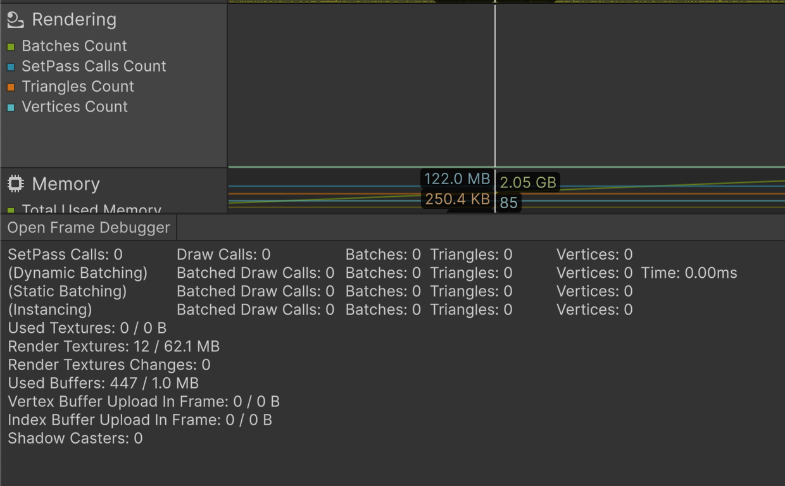
SetPass 콜 수가 많다는 것은 메테리얼과 셰이더 변경이 자주 발생하고 있다는 의미이다.

## 메모리 모듈
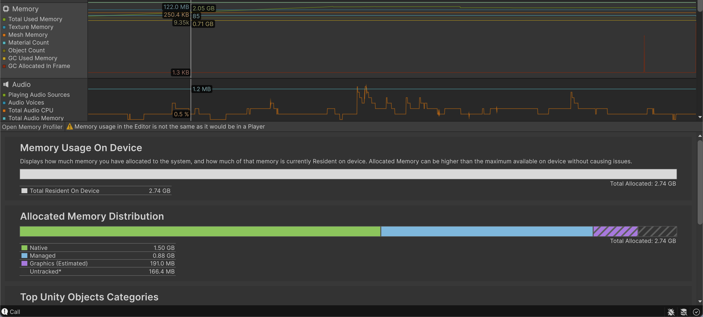
카테고리별 메모리 사용량의 변화를 실시간으로 보여준다.

- 총 메모리 사용량
- 텍스처 메모리, 메시 메모리
- 메테리얼 수
- 유니티 오브젝트 수
- GC 힙 사용량
- 프레임별 CG 힙 할당량

그래프에서 GC Allocated in Frame 항목이 짧은 주기로 큰 스파이크를 보이면 매 프레임 불필요한 동적 할당이 반복되고 있음을 의미한다.

## UI 모듈과 UI 디테일 모듈
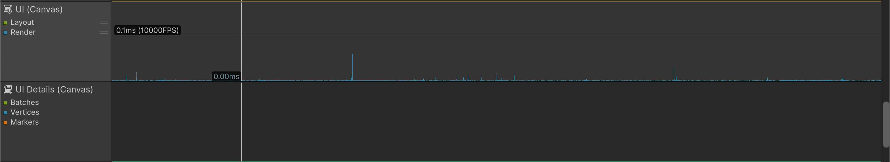
UI 레이아웃 갱신 시간과 렌더링 시간, 배치 수를 함께 표시한다. UI 구조의 복잡성 등을 확인할 수 있다.


# 이모저모
프로파일러의 존재는 대강 알고 있었지만 이렇게 깊게 보게 된 것은 처음이고, 처음보는 유용한 기능이 많은것을 확인했다. 또한, 기존에 정확하게 모르고 사용한 여러가지 정보들의 세부적인 내용을 확인할 수 있었다고 생각한다. 특히 샘플을 어떻게 보고 확인하는지 정확하게 모르고 있어서 ms만 중점적으로 봤었는데, 여러 시점으로 볼 수 있게 된 것 같다. 
