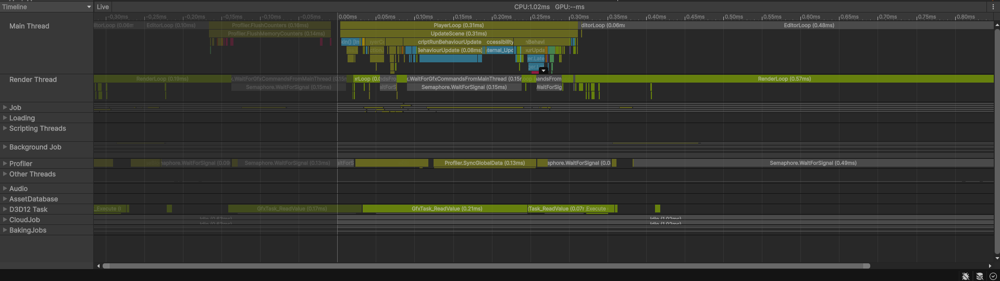
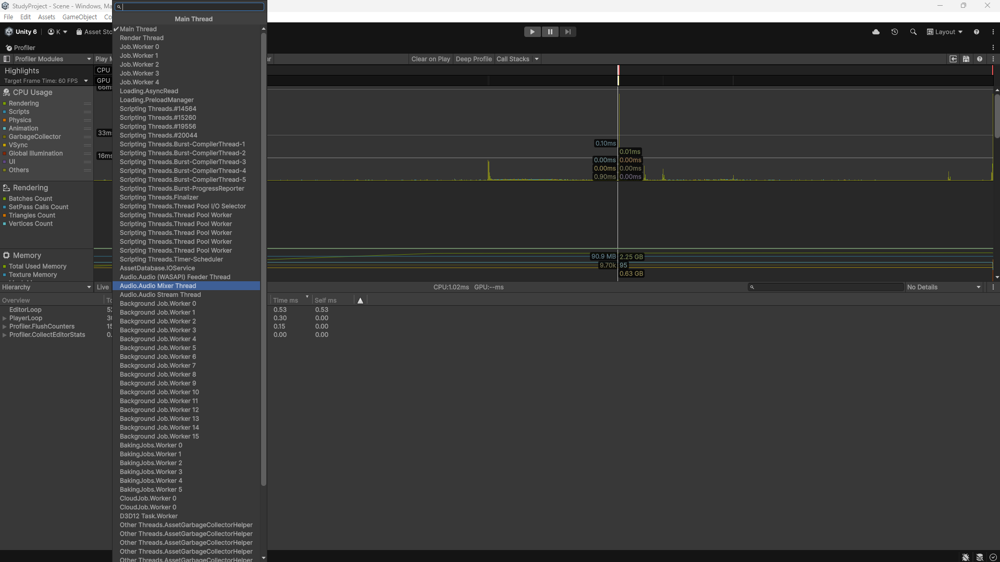
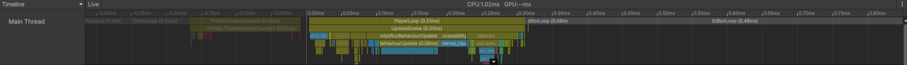
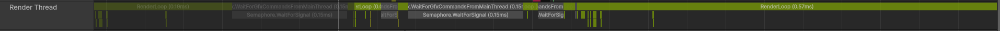
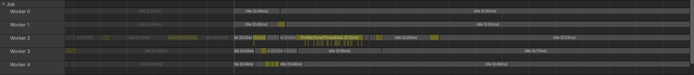
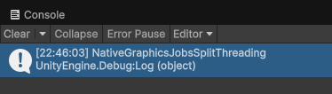

# 스레드

유니티는 다중 코어를 활용하는 멀티 스레드 엔진이다. CPU 프로파일러의 타임라인 뷰를 사용하면 여러 스레드가 동시에 실행되는 것을 확인할 수 있다.


CPU 프로파일러의 하이어라키 뷰에서는 드롭다운 메뉴로 스레드 목록을 확인, 선택 후 해당 스레드의 실행 내용을 확인할 수 있다.

CPU 성능 문제는 모든 스레드에서 동시 병목이 되는 일을 거의 없고, 대부분 하나의 스레드에서 집중적으로 발생한다. ㄸ환 하나의 스레드에서 발생한 지원은 다른 스레드에 영향을 주어 대기 시간을 늘리는 구조가 된다. 그렇기에 성능 분석의 첫 단계는 어떤 스레드가 병목 상태인지 식별하는 것이다.

유니티의 주요 스레드는 아래와 같다.


- **메인 스레드**
게임 로직과 엔진 루프, 대부분의 C# 스크립트가 실행되는 중심 스레드

- **렌더 스레드**
메인 스레드의 명령을 전달받아 GPU 드로우 콜을 처리하는 스레드

- **워커 스레드**
잡 시스템을 통해 분배된 병렬 연산을 수행하는 스레드

> **잡 시스템(Job System)**
작업 = job를 여러 CPU 코어에 분산시켜 병렬로 처리할 수 있도록 해주는 것
사용하는 이유: 대량의 계산을 여러 코어로 나눠서 처리하기 위해서

## 메인 스레드
MonoBehaviour의 주요 이벤트 함수인 Awake, Start, Update 등 플레이어 루프, 대부분의 C# 스크립트가 실행되는 스레드이다.

대부분의 게임 로직, 엔진 내부 처리가 이루어지기에 CPU 성능을 분석할 때 메인 스레드를 가장 먼저 확인한다.

### 플레이어 루프(게임 루프)
메인 스레드 내부의 처리는 한 프레임 단위로 플레이어 루프라는 순차 구조를 따라 진행된다.

플레이어 루프는 크게 다음과 같은 순서로 진행된다
1. 물리 갱신
2. 게임 로직 처리
3. 렌더링

```
[한 프레임]
  ↓
Initialization        (초기화)
EarlyUpdate           (입력 이벤트 처리 등)
FixedUpdate           (물리 - 고정 시간 간격, 프레임당 0~N번)
PreUpdate
Update                (일반 게임 로직, MonoBehaviour.Update)
PreLateUpdate         (애니메이션 등)
PostLateUpdate        (LateUpdate, 렌더링, 카메라)
  ↓
[다음 프레임]
```

이 루프는 모든 단계가 순차적으로 실행되기에, 한 단계에서 지연이 생기면 이후 모든 단계가 늦어지게 된다.

## 렌더 스레드
렌더링과 관련된 처리를 실행하는 CPU 스레드이다. 그래픽스 처리는 GPU뿐만 아닌, GPU가 실행할 렌더링 명령을 구성하고 전송하는 과정이 CPU에서도 같이 일어난다.

> **렌더 처리를 모두 메인 스레드가 담당할시 생기는 문제점**
게임 로직 처리가 늦어지며 전체 프레임이 지연될 수 있음. 그렇기에 유니티는 렌더 스레드를 별도로 두어 렌더링 관련 처리를 분리하여 실행한다.

> 렌더 스레드가 존재해도 메인 스레드에서 렌더링 관련 처리가 없는 것은 아님. 일부 렌더링 처리는 메인 스레드에서 수행됨

*Renderer 컴포넌트는 메인 스레드에서 동작하는 MonoBehaviour 오브젝트이다. 즉, 렌더링 요청 코드는 메인 스레드에서 실행된다
메인 스레드에서 실행된 유니티 C# 렌더링 API는 GPU에서 드로우 명령을 직접 실행하지는 않는다. 대신 렌더 스레드에서 네이티브 그래픽스 명령으로 실행될 중간 명령을 생성한다. 렌더 스레드는 이 중간 명령을 로우레벨 그래픽스 명령으로 변환하여 GPU 드라이버를 통해 GPU에게 전달한다.*

### 렌더 스레드 동작 방식의 종류
렌더 스레드의 동작은 2가지 유니티 프로젝트 설정 조합에 따라 달라진다

- Use Multithreaded Render
- Use Graphics Jobs

이 조합에 따라 렌더 스레드의 동작 방식은 다음과 같이 구분한다.

- **다이렉트**
렌더 스레드를 사용하지 않고 메인 스레드에서 직접 렌더링을 수행
- **멀티 스레드**
메인 스레드에서 중간 명령을 생성하고 렌더 스레드에서 이를 로우 레벨 명령으로 변환
- **그래픽스 잡 사용**
렌더 스레드뿐만 아니라 워커 스레드도 함꼐 활용해 그래픽스 처리를 수행

렌더 스레드의 동작은 내부적으로 6가지 모드로 나뉜다. 현재 게임에서 사용 중인 렌더 스레드 동작 모드는 C# API의 SystemInfo.renderingThreadingMode 프로퍼티를 통해 확인할 수 있다.

```
using UnityEngine;

public class RenderingThreadingModeCheck : MonoBehaviour
{
    void Start()
    {
        Debug.Log(SystemInfo.renderingThreadingMode);
    }
}
```


이렇게 확인이 가능하다

- **Direct**
렌더 스레드를 사용하지 않음, 모든 렌더링 처리가 메인 스레드에서 직접 실행된다.
- **SingleThreaded**
API 레벨에서는 멀티 스레드 구조를 유지하지만 디버깅을 위해 렌더링을 단일 스레드로 실행하는 모드
- **Multithreaded**
메인 스레드에서 중간 그래픽 명령을 생성한다. 렌더 스레드에서 해당 명령을 로우 레벨 그래픽스 명령으로 변환한다.
- **LegacyJobfied**
워커 스레드를 통해 중간 그래픽스 명령을 생성한다. 하나의 렌더 스레드가 이를 로우 레벨 그래픽스 명령으로 변환한다.
- **NativeGraphicsJobs**
메인 스레드에서 중간 명령을 생성한다. 렌더 스레드가 이를 로우 레벨 그래픽스 명령으로 변환한다. 이 과정에서 렌더 스레드는 일부 작은 작업을 워커 스레드에 분산한다.
- **NativeGraphicsJobsWithoutRenderTheread**
렌더 스레드를 사용하지 않는다. 워커 스레드가 중간 명령 생성과 로우 레벨 명령 변환을 모두 처리한다.

### 싱글 스레드 렌더링
Multithreaded Rendering과 Use Graphics Jobs 설정을 모두 비활성화하면 싱글 스레드 방식으로 동작한다.

> **유니티의 클라이언트**
그래픽스 명령을 GPU에 요청하는 역할을 담당하는 객체

싱글 스레드 렌더링에서는 하나의 클라이언트만 존재하며 메인스레드에서 사용된다. 클라이언트로부터 그래픽스 명령을 전달받는 실제 그래픽스 하드웨어인 GPU는 코드상에서 GfxDevice 타입으로 추상화 되어 있다.

메인 스레드는 렌더링 타이밍에 클라이언트를 통해 렌더링 명령(Rendering Commands = RCMD, 중간 단계 명령)을 실행한다. 해당 명령은 다시 로우 레벨 그래픽스 명령으로 변환되며 GfxDevice에 의해 실행된다.

> 이때 어쩔 수 없는 변환 오버헤드가 발생한다. 유니티는 이를 Batching = 여러 개의 draw 명령을 하나로 묶어 변환, 제출 횟수를 줄이는 기법 / Graphics Jobs = 변환 작업을 여러 워커 스레드로 분산 등으로 비용을 줄이려 한다.

이 구조에서 모든 그래픽스 명령 실행 과정이 메인 스레드에서 이루어 진다. 그렇기에 다른 로직 실행의 지연을 가져오게 된다.

구조는 단순하지만, CPU 자원 활용율이 낮아 프레임 단위 대기 시간이 가장 길어지는 방식이다.

### 멀티 스레드 렌더링
유니티 프로젝트의 기본값 설정이다.

렌더 스레드를 사용하며, 메인 스레드는 상위 레벨의 렌더링 코드를 실행하고 로우 레벨 그래픽스 코드는 렌더 스레드에서 실행된다.

메인 스레드(클라이언트) =>RCMD=> 렌더 스레드(GfxDeviceClient) =>GCMD=> GfxDevice
의 구조로 실행된다.

1. 클라이언트가 중간 명령인 RCMD를 모두 렌더 스레드로 전달한다.
2. 렌더 스레드에서 GfxDeviceClient 객체가 해당 명령을 GCMD로 변환, GfxDevice를 통해 실행한다

**장점**
1. 중간 명령에서 로우 레벨 그래픽스 명령으로 변환되는 과정을 메인 스레드가 대기하지 않아도 된다.
2. GfxDevice에서 GCMD를 실행하는 시간 즉 GPU의 처리 시간을 렌더 스레드가 대기하고, 메인 스레드는 이 시간에 렌더 스레드의 GPU 대기와 무관하게 다른 처리를 이어서 수행할 수 있다.

### 그래픽스 잡 렌더링
기본값으로 비활성화 되어 있다.

다중 스레드를 활동한다. 하지만 로우 레벨 그래픽스 명령 실행에 렌더 스레드만 사용하던 기존 멀티 스레드 방식과 달리 다수의 워커 스레드가 해당 처리를 분산 수행한다.

메인 스레드(Client) =>RCMD=> 워커 스레드(GfxDeviceClient)[다수] =>GCMD=> GfxDevice

다수의 RCMD를 동시에 처리할 수 있기에 렌더링 처리를 더 효율적으로 빠르게 마칠 수 있다. 다만, 이 방식을 사용해도 렌더 스레드를 완전히 사용하지 않는 것은 아니다. RCMD를 GCMD로 변환하는 과정 외 렌더링 처리가 존재할 수 있고, 이 중 일부는 구현 방식에 따라 여전히 렌더 스레드에서 실행될 수 있다.

그래픽스 잡은 많은 CPU 코어를 보유한 환경에서는 큰 성능 향상을 기대할 수 있다. 하지만, 다중 코어를 활용하기 어려운 경우 성능 제한, 저하를 만들 수 있기에 사용에 주의를 해야 한다.

### 워커 스레드(잡 스레드)
멀티 스레드는 효율적으로 작업을 병렬 처리하여 병목을 완화할 수 있지만, 데드락, 데이터 종속성 같은 문제를 가져올 수 있다.

유니티는 잡 시스템을 통해서 쉽고 안전하게 멀티 스레드 프로그래밍을 구현할 수 있도록 지원한다. 잡 시스템에서는 CPU가 계산을 많이 처리해야 하는 작업을 잡 단위로 추상화할 수 있다. 유니티는 이러한 잡을 실행하기 위한 워커 스레드가 풀링되어 있다.

유니티 내부의 기능들도 이미 잡 시스템을 통해 멀티 코어를 활용하도록 구현되어 있다.

- 애니메이션 업데이터
- 물리 시뮬레이션
- 파티클 시뮬레이션

이와 같은 처리들은 CPP잡으로 구현되어 있다. 필요에 따라 C# 잡 시스템을 통해 직접 워커 스레드를 활용하는 코드도 작성할 수 있다.


# 이모저모
스레드 개념은 대강 알고 있었는데, 해당 공부에서 자세하고, 어떻게 내부 flow가 이루어 지는지, low level graphics들이 어떻게 호출되어 사용하는지 알 수 있어서 유익했다.