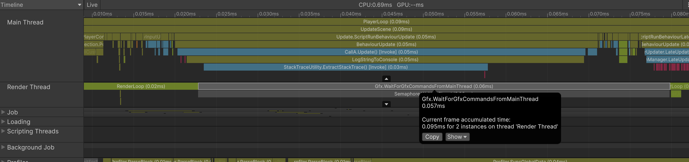
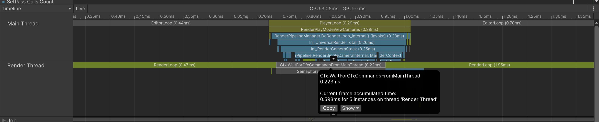
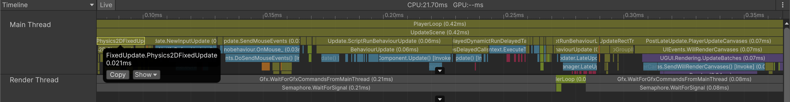
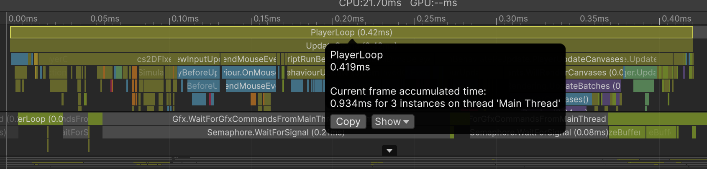
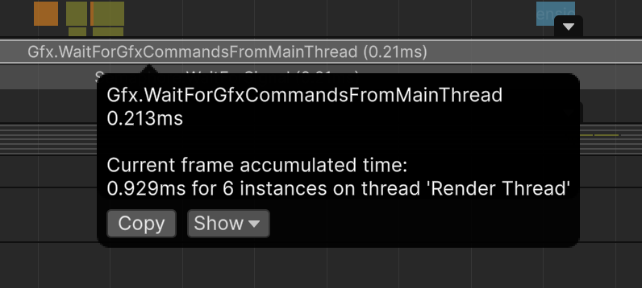
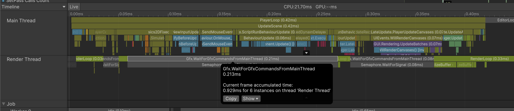
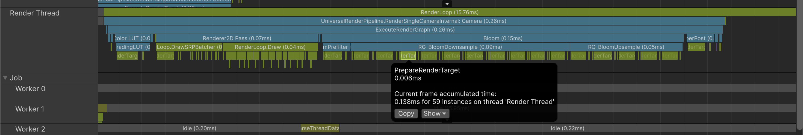
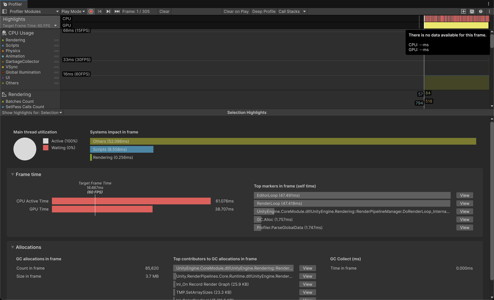

## 병목 스레드 찾기
전체 스레드가 모두 동시에 병목이 되는 경우는 매우 드물다. 그렇기에 프로파일러로 어떤 스레드에서 병목이 발생하는지 파악하는 것이 중요하다.

이때 첫 단계로 CPU 프로파일러에서 멩니 스레드가 다른 스레드 작업 완료를 대기하고 있는지를 확인해야 한다. 이때 아래의 대기 마커를 확인할 필요가 있다.

### 메인 스레드에서 확인되는 주요 대기 마커

- **Gfx.WaitForPresentOnGfxThread**
렌더 스레드 병목 또는 GPU 병목

- **WaitForJobGroupID**
잡 워커 스레드 병목

WaitForJobGroupID는 직접 확인하려 했는데 확인이 되지 않는다.

> **WaitForJobGroupID** — "A Sync Fence on a JobHandle was triggered. This might lead to work stealing..."

상시 마커가 아니라, 메인 스레드에서 Job의 결과를 필요로 하는 시점 = JobHandle.Complete()에 도달했는데, 워커 스레드가 해당 Job을 완료하지 못했을때 메인 스레드가 멈추게 되며, 그 시간이 해당 마커로 기록된다.

즉, 지금 씬은 거의 비어 있기에 메인 스레드가 대기할 필요가 없어서 해당 마커가 확인이 되지 않는 것이다.

### 렌더 스레드에서 확인되는 주요 대기 마커

- **Gfx.PresentFrame**
GPU 병목

- **Gfx.WaitForCommands**
메인스레드 병목

> 책에 표기된 Gfx.WaitForCommands는 구버전 마커라고 한다. unity 6부터는 Gfx.WaitForGfxCommandsFromMainThread라는 이름으로 찍힌다.

병목이 여러 지점에서 발생할 수도 있는데, 이때에는 병목이 더 심하게 나타나는 지점을 우선적으로 최적화 해야 한다.

### CPU 프로파일러 쉽게 읽는법
CPU 프로파일러의 타임라인 뷰는 플레이어 루프의 실행 순서를 그대로 따른다. 그렇기에 왼쪽에서 오른쪽으로 읽으면 한 프레임간 어떤 처리가 순서대로 일어났는지 알 수 있다.

(좀 더 유효한 정보를 얻기 위해서 실제 작업중인 프로젝트에서 프로파일러를 확인했다.)

FixedUpdate(물리 갱신) => BehaviourUpdate(게임 로직) => FinishFrameRendering(렌더링)
순으로 업데이트 된다

(FinishFrameRendering는 왜인지 모르겠는데 실제로 확인이 안된다)

타임라인을 살펴볼때 아래 3개지를 중심으로 확인한다

- 가장 긴 블록
실행 시간이 길어 병목이 발생했을 가능성이 높은 구간

- 회색 대기 마커
다른 스레드의 작업을 기다리고 있는 상태

- 스레드 간 동기 구간
예시로 메인 스레드가 렌더 스레드를 기다리는 상황

해당 시점을 기반으로

메인 스레드 => 렌더 스레드 => 워커 스레드

순서로 타임 라인을 따라가면 병목지점이 어드 스레드인지 쉽게 파악할 수 있다.

### 메인 스레드 병목

> **Gfx.WaitForGfxCommandsFromMainThread**
렌더 스레드가 메인 스레드에서 생성되는 그래픽스 명령을 기다리는것
(스레드가 다른 스레드의 작업을 기다리고 있는 상태는 회색으로 표시된다)

유니티에서는 Start, Update와 같은 게임 로직 이벤트 함수가 렌러링 이벤트보다 먼저 실행된다. 그렇기에 플레이어 루프 앞부분인 물리 처리, 게임 로직 처리가 지연되면 렌더 루프 타이밍이 늦어진다. 메인 스레드가 렌더 루프에 진입하지 못하면 렌더 스레드는 수행할 작업이 없기에 대기 상태에 머무르게 된다.
이때에 렌더 스레드가 메인 스레드로부터 렌더링 명령을 기다리는 흐름에서는 렌더 스레드에 WaitForGfxCommandsFromMainThread 마커로 표시된다.

**메인 스레드 병목 최적화하기**
메인 스레드 병목을 확인한 이후 이를 해결하는 일반론은 아래와 같다

- **코드 최적화**
병목의 원인이 되는 코드를 찾아 최적화
알고리즘과 데이터 구조를 개선

- **멀티 스레딩과 비동기 처리**
메인 스레드에서 부하가 큰 작업을 다른 스레드나 비동기 처리로 분산
Job을 사용하여 워커 스레드로 작업을 분산
코루틴 등을 사용해 특정 처리를 여러 프레임에 나누어 실행

- **렌더링 최적화**
렌더링되는 객체 수와 카메라 수를 줄이기
포스트 프로세싱 효과의 사용을 최소화

만약 기존의 마커로 병목지점이 확실하게 파악이 되지 않는다면 프로파일러 마크를 추가해서 확인한다.

### 렌더 스레드 병목
렌더 스레드에서 병목이 확인될 경우 해당 병목이 CPU 렌더 스레드 병목인지 혹은 GPU 병목인지를 구분해야 한다. 그래픽스 처리는 CPU, GPU 양쪽에서 모두 수행되기 때문이다. 즉, CPU에서 병목이 있을 수도 있다.

해당 사항은 아래와 같다

- CPU에서 로우 레벨 그래픽스 명령을 생성하는데 걸리는 시간
- CPU에서 그래픽스 명령과 텍스처 그리고 셰이더 등을 업로드하는 과정에서 발생하는 지연
- 그 외 CPU에서 처리되는 그래픽스 관련 연산 문제
- 렌더 스레드가 GPU의 작업 완료를 기다리면서 발생하는 병목

일반적으로 렌더 스레드의 CPU 병목은 그래픽스 명령을 생성하거나, 셰이더와 텍스처 등을 GPU에 업로드하는 과정에서 발생한다.

현대의 GPU는 성능이 매우 올라갔기 때문에 보통 CPU 연산 성능 문제가 아닌, GPU로 리소스를 전송하는 과정에서 병목이 많이 발생한다.

### GPU가 병목인 상황

PrepareRenderTarget 마커는 렌더링이 사용할 렌더 타깃을 준비하는 과정을 나타내는 마커이다.

해당 마커가 길고 많은수록 많은 후처리를 사용하는 것이다. 사진의 경우는 문제가 없지만 악화되는 경우 다음 후처리의 렌더 타밋을 준비할때 시간적 악영향을 준다.

### 다른 여러 방법

- **하이라이트 모듈**

유니티6에서 추가된 모듈이며 프레임 예산을 초과한 프레임을 하이라이트로 표시한다. 그리고 해당 프레임의 CPU, GPU 프레임 타임을 보여준다.

- **Xcode Metal 디버거**
mac환경에서 ios앱에 metal디버거를 연결하면 FPS, CPU, GPU 상황을 파악할 수 있다.