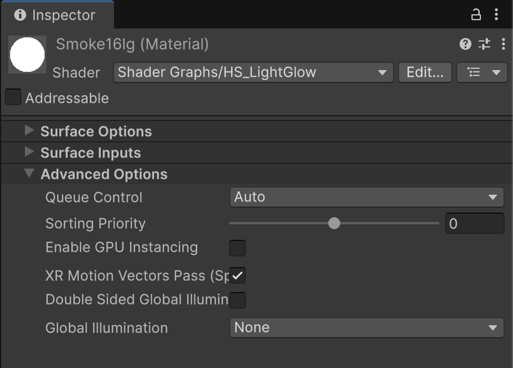
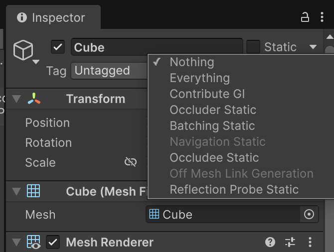
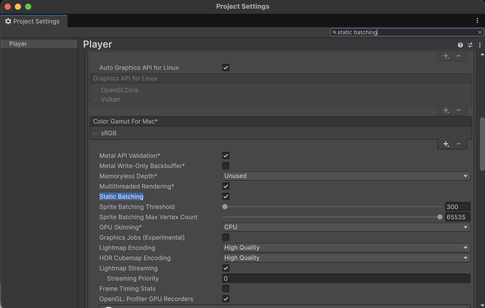
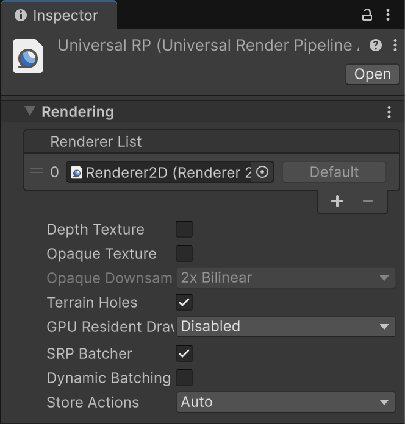
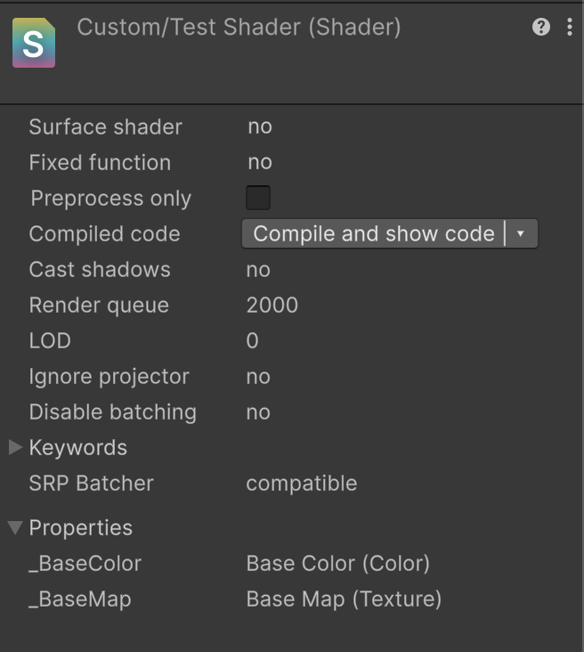

## 렌더링 병목
대중적으로 많은 드로우콜이 병목의 원인으로 꼽지만, 현대의 GPU는 충분이 강력하기 때문에 이는 크게 문제가 되지 않는다.

일반적으로 더 큰 비용은 렌더 파이프 라인 상태 변경에 있다.

일반적으로 연산 자체보다 연산 준비에 비용이 더 크기 때문이다.

> 렌더 파이프라인 상태 전환은 CPU, GPU 모두에게 비용이 든다.

### CPU 부담
유니티에서 드로우 직전 다른 셰이더 패스를 사용할시 내부적으로 그래픽스 드라이버에 새로운 상태를 설정하라는 명령이 들어간다. 이 과정에서 API 호출 오버헤드가 발생하여 GPU로 전송해야 하는 버퍼가 늘어난다.

### GPU 부담
새로운 렌더 파이프라인 상태를 위하여 기존 파이프라인을 멈추고 재구성하는 과정이 필요하다. 이때 GPU 파이프라인에 지연이 발생하며, 누적될 수 있다.

위의 사실을 기반으로 드로우 콜보다 렌더 파이프라인 상태 변경을 최소화 하는것이 중요하다는 것을 인지할 수 있다. 유니티에서는 이를 SetPass콜 횟수로 나타낸다.

> **SetPass**
GPU 상태를 설정하는 명령

>**Batch (배치)**
명령어를 실행하는 순서를 조정하고 여러 명령어를 더 적은 수의 명렁어로 합쳐 한 번에 실행하는 방식

**정점 수가 적은 메시는 비효율적이다**
정점 수가 적은 메시를 렌더링 하는 작업은 GPU를 효율적으로 사용하지 못하는 문제가 있다.

- 렌더링 속도
다수의 작은 메시 < 하나인 대량의 정점을 가진 메시

일반적으로 정점수가 256 = 2^8 보다 작은 메시는 GPU의 처리단위인 웨이브프론트, 워프에서 대기하는 스레드가 많아지기 때문이다.

## 드로우콜 최적화
유니티에서는 아래의 최적화 방법이 있다

- GPU 인스턴싱
- 드로우 콜 배칭
    - 정적 배칭
    - 동적 배칭

### GPU 인스턴싱
동일한 메시와 메테리얼을 공유하는 다수의 오브젝트를 하나의 드로우 콜로 그리는 방법
(지오메트리 인스턴싱 = Geometry Instancing 이라고 부르기도 한다.)

인스턴스 간에 공유되는 지오메트리 데이터가 1번만 업로드 되어서 CPU의 부담이 줄어들고 전체적인 렌더링 성능이 향상된다.

GPU 인스턴싱은 반복되는 오브젝트를 그릴때 유용하다.


유니티에서는 메테리얼 인스펙터에서 활성화를 할 수 있다.

**한계점**
결국 메시, 메테리얼을 공유한다는 전제로 사용되는 기술이기에, 서로 다른 메시, 메테리얼을 사용할시, 비효율적임

또한 일부 렌러딩 기능과 호환이 안될 수 있기 때문에 개발에 제약이 생길 수 있다.

### 드로우 콜 정적 배치
움직이지 않는 다수의 메시를 소수의 메시로 합쳐 드로우 콜을 줄이는 방식

런타임에 CPU를 사용하지 않기에, 일반적으로 동적 배치보다 효율적이다.

정적 배치에는 아래의 제약이 있다.
- 움직이지 않는 물체에만 적용이 가능하다
- 여러 메시를 합쳐 새로운 메시를 만들기에, 메모리 사용량이 증가한다

유니티에서 사용법


Batching Static을 켜준뒤


Player setting에서 활성화해준다

### 드로우 콜 동적 배치
여러 메시를 런타임 하나로 결합해 드로우 콜 수를 줄이는 방식

GPU는 각 메시의 정점을 모델 공간에서 월드 좌표계 공간으로 변환하는데, 동적 배치는 이 과정을 CPU가 대신 수행해서 여러 메시를 월드 공간으로 변환하여 하나의 큰 메시로 병합한다.

드로우 콜 수를 줄이고 GPU에서 수행되는 월드 공간 변환 비용을 줄여준다. 하지만 CPU에서 수행되는 추가 처리 비용이 드로우 콜 감소로 인한 성능 향상보다 커질 수 있기에 주의가 필요하다.

**왜 사용되었는가**
과거의 저사양 모바일 기기의 GPU 성능이 제한적이였기에 CPU의 성능을 가져와 사용하는것이 유용했다. 또한 개별 드로우 콜 비용이 커 드로우 콜 수를 줄이는 것이 중요했다. 이는 멀티스레딩 성능이 낮아 단일 스레드에서 처리하는것이 더 좋다는 배경 상황이 있다.
현대에는 GPU 성능이 상향 평준화 되고, 멀티 스레드에 특화된 CPU 설계가 사용되고, 그래픽스 API들도 이를 지원한다.

유니티에는 위와같은 이유때문에 기본적으로 비활성화 되어 있다.

수동으로 활성화 하려면 PlayerSetting => OtherSettings => Dynamic Batching 항목으로 활성화 할 수 있다.

**동적 배치 제약**
동일한 메테리얼을 사용하는 메시끼리만 매칭할 수 있다.


### 동적 생성되는 지형들에 대한 동적 배치
유니티에서는 실시간으로 정점 데이터가 생성되는 렌더러에 항상 동적 배치를 사용하여 최적화 한다.

각 정점의 위치를 CPU에서 계산하고 월드 공간 기준으로 시뮬레이션 후 단일 메시 형태로 렌더링한다.

> 파티클 시스템과 같은 렌더러는 CPU에서 월드 공간 기준으로 시뮬레이션 된 정점 데이터를 런타임에 하나의 동적 메시로 생성하는 방식에 가깝다. 각 파티클 시스템은 자체적으로 하나의 드로우 콜들 생성하며, 여러 파티클 시스템이 하나의 드로우 콜로 합쳐지지는 않는다.

### 메시 수동 결합
런타임에 Mesh.CombineMeshes()메서드를 사용하면 여러 메시를 직접 결합해 드로우 콜 수를 줄일 수 있다.

해당 방식은 무작위 위치에 오브젝트를 생성후 움직이지 않는 경우에 적합하다.

해당 방식은 초기에 CPU 리소스를 사용하고 이후 겹합된 메시는 재사용할 수 있는 상태가 된다.

## SRP 배처
드로우 콜 사이에서 발생하는 렌더 파이프라인 상태 변화를 줄이는 배처이다.

자주 변하는 데이터와 거의 변하지 않는 데이터를 서로 다른 상수 버퍼로 분리해 관리하는 데 있다.

SRP 배처의 동작은 다음 2개 시점에서 이해할 수 있다.

- 드로우 콜을 그룹화
- 렌더 파이프라인 상태 변화를 최소화

### 상수 버퍼 Constant Buffer, CBuffer
상수 버퍼에는 셰이더에서 사용하는 상수 데이터가 저장된다. 이는 GPU에 업로드 되어서 GPU 메모리를 차지하여 셰이더는 이 상수 버퍼에 저장된 값을 가져와 연산에 사용한다.

상수 버퍼는 여러 셰이더 프로그램이 공통으로 접근할 수 있어 동일한 데이터를 중복으로 선언하지 않고 여러 셰이더 단계에서 활용할 수 있는 장점이 있다.

상수 버퍼에 저장되는 데이터들
- 월드 행렬
- 뷰 행렬
- 투영 행렬
- 등등

### 상수 버퍼 최적화
CPU에서 GPU로 상수 버퍼를 업로드 할때는 크게 2가지 성능 비용이 발생한다

- **CPU 비용**
상수 버퍼를 구성하고 그래픽스 드라이버 API를 호출하는 과정에서 발생하는 CPU 처리 시간
- **대역폭 비용**
CPU에서 GPU로 상수 버퍼를 업로드하는 데 소요되는 시간

상수 버퍼 최적화는 아래 2가지 측면에서 접근한다

- **업데이트 주기가 동일한 데이터는 하나의 버퍼로 묶기**
GPU에 상수 버퍼를 설정하는 API 호출에는 고정적인 CPU 오버헤드가 발생한다. 그렇기에 동일한 타이밍에 값이 변경되는 데이터는 각각 별도의 상수 버퍼를 생성하기 보다는 하나의 상수 버퍼로 묶어서 전송하는 것이 더 효율적이다.

- **업데이트 주기가 다른 데이터는 서로 다른 상수 버퍼로 분리**
상수 버퍼는 명시적으로 갱신하기 전까지 GPU 메모리에 계속 상주한다. 이때 변화가 없다면 재갱신을 할 필요가 없기에 성능상 이점이 생긴다.

매 프레임 갱신되는 데이터와 변하지 않는 데이터를 하나의 상수 버퍼로 관리할시, 갱신이 필요 없는 데이터도 갱신하는 리소스 낭비가 생긴다.

### SRP 배처
상수 버퍼를 별도로 분리해 관리하는것. 상수 버퍼 갱신 횟수를 줄이고 전체 렌더링 성능을 향상 시킬 수 있다.


렌더 파이프라인 에셋에서 Batcher 옵션이 있으며

쉐이더 파일에서 SRP Batcher 항목에서 지원 여부를 확인할 수 있다.

쉐이더가 SRP 배처에 호환이 될려면 쉐이더 내부의 유니폼 변수를 CBUFFER 블록으로 묶어서 UnityPerMeterial 상수 버퍼 단위로 관리하도록 지정해야 한다.

```
CBUFFER_START(UnityPerMeterial)
float4 _Color;
sampler2D _MainTex;
CBUFFER_END
```

SetPass 콜 수가 줄어드는 것으로 SRP 배처의 동작 여부를 확인할 수 있다.

## 배치 우선순위
각 배치들은 성격이 다르고 적절한 상황이 다르고, 동시 사용이 불가능할 수 있다.

유니티는 아래와 같은 우선순위로 배치를 적용한다

1. 정적 배치와 SRP 배처
2. GPU 인스턴싱
3. 동적 배치

이때 GPU 인스턴싱은 SRP 배치와 함께 사용이 불가능하다.