## 프레임 디버거
앱을 일시 정지한 상태에서 현재 프레임을 구성하는 유니티 랜더링 이벤트를 순서대로 보여주는 도구

- 렌더링 순서 시각화
- 렌더링 최적화 단서 찾기
- 렌더링 배치 분석
- 그래픽 버그 분석

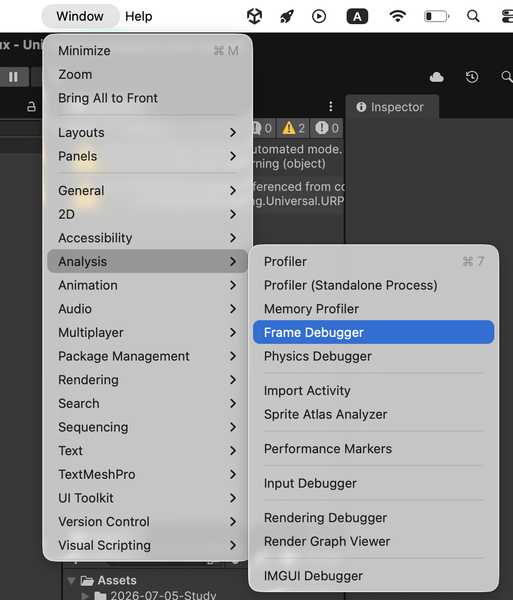
상단

Window => Analysis => Frame Debugger

로 열 수 있다

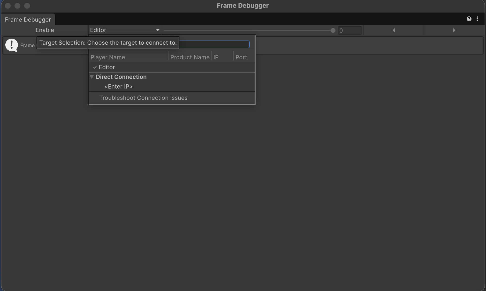
창을 연 뒤에는 원하는 플레이어를 연결할 수 있다. 이때 개발자 모드가 활성화된 빌드만 연결이 가능하다.

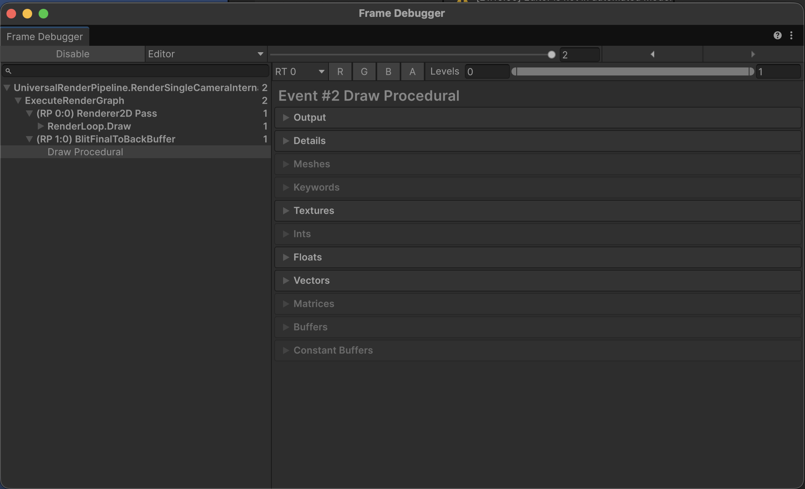

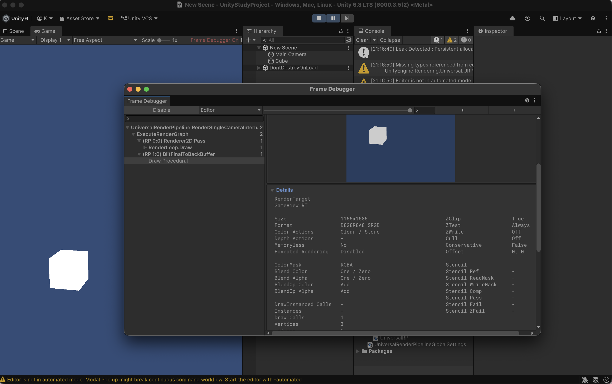
연결된 상태에서 **Enable**을 누를시 플레이어가 일시정지되면서 해당 프레임을 그리는 과정에 사용된 렌더링 이벤트들을 프레임 디버거에 표시해준다.

프레임 디버거 창의 구성은 아래와 같다

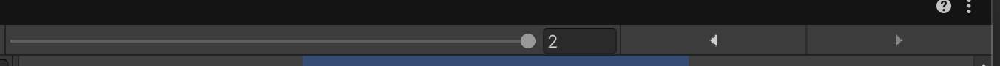

- **이벤트 스크러버**
현재 프레임에서 발생한 렌더링 이벤트를 앞뒤로 이동하며 확인가능

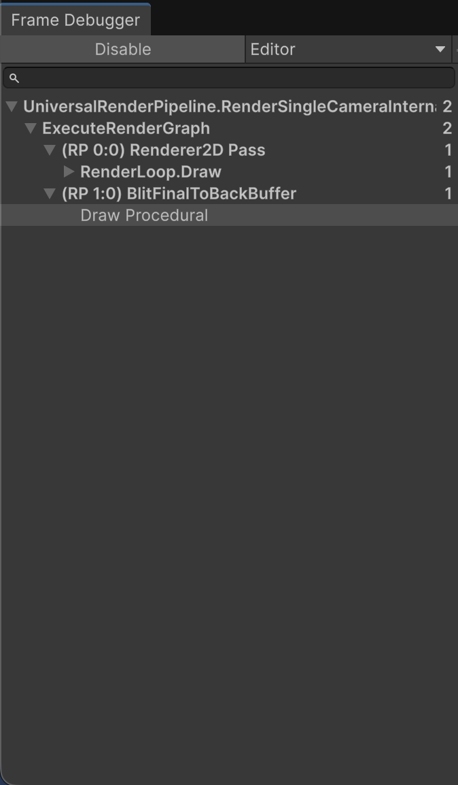

- **이벤트 계층 구조**
현재 프레임을 구성하는 렌더링 이벤트들이 계층 구조로 나열됨

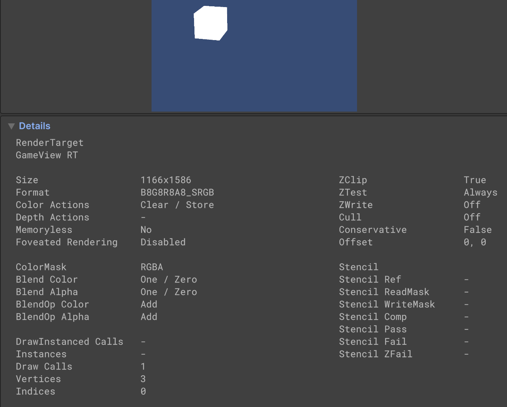

- **이벤트 정보 패널**
선택한 렌더링 이벤트에 대한 상세 정보 표시

**렌더링 이벤트**
유니티 렌더링 API 커맨드 버퍼에 기록된 개별 렌더 명령 1개를 의미한다. 화면에 갱신되는 가장 작은 실행 단위이다.

다만 SRP배처를 사용시 동일 쉐이더 베리언트를 사용하는 다수의 드로우 콜이 하나의 SetPass 콜 아래에서 그룹화 되어 실행되기에 렌더링 이벤트를 드로우콜 1개로 치환해서 생각하면 안된다.

> 쉐이더 베리언트(Shader Variant)
하나의 쉐이더 소스 파일에서 전처리 분기 조합에 따라 컴파일되어 나오는 개별 쉐이더 프로그램 실체

### 프레임 스크러빙

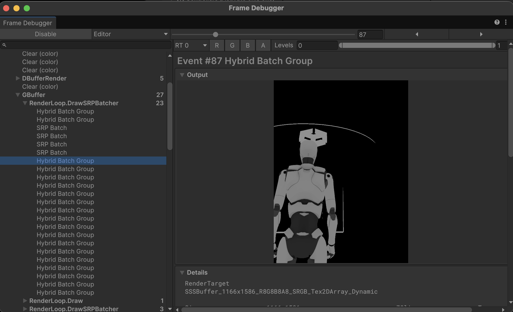
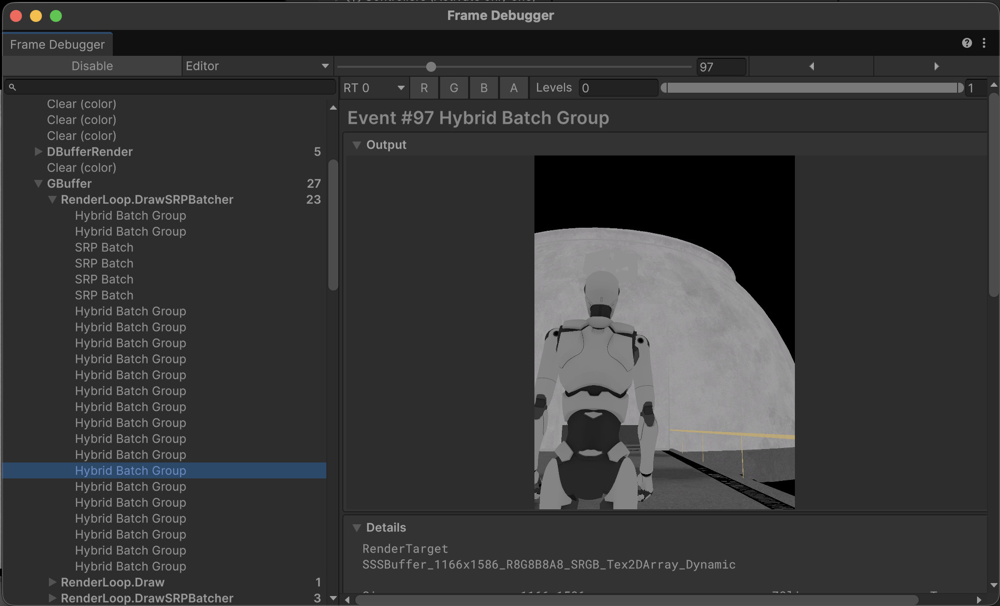
좌측 이벤트 계층 구조창에서 각 요소를 클릭하여 순서대로 어떻게 렌더링 되는지 확인할 수 있다. 해당 기능을 사용해여 불필요하게 렌더되는 오브젝트를 확인하는 것이 가능하다.

### Detail
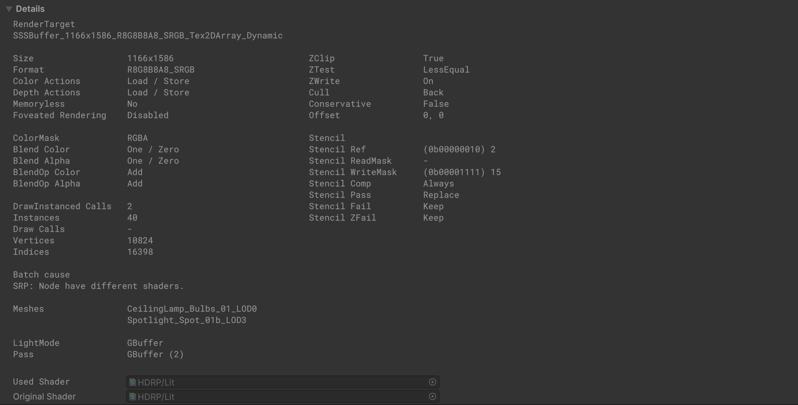
아래 요소를 확인 가능하다

- 사용된 렌더 타깃 정보
- 블렌딩과 컬러 마스크 등 렌더 상태
- 발생한 드로우 콜 수
- 정점 수와 인데스 수
- 사용된 셰이더와 패스 이름
- 사용된 메시
- Batch Cause(이벤트가 하나의 배치로 묶이지 못한 이유)

이때 드로우 콜 수와 Batch Cause가 렌더링 최적화에서 중요한 지표로 사용된다.

### Keywords
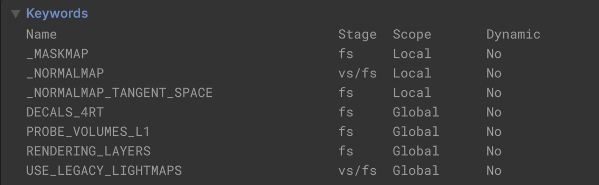

사용중인 셰이더 키워드 조합을 확인할 수 있다.

- 셰이더에서 어떤 기능이 활성화되어 있는지
- 불필요한 키워드가 포함되어 있는지(불필요한 셰이더 베리언트가 생성되었는지)
- 배치가 묶이지 않는 원인에 대한 단서

### 셰이더 입력 데이터들
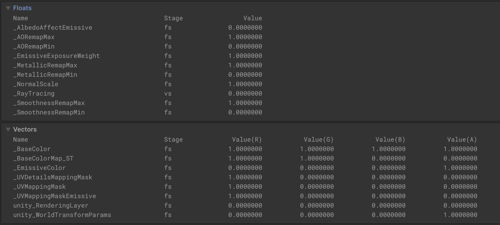

셰이더로 전달된 파라미터 값을 확인할 수 있다.

vs = 버텍스 셰이더
fs = 프래그먼트 셰이더

해당 값들은 그래픽 버그, 아티팩트, 글리치가 발생해쓸시 중요한 단서가 된다.

### 메시
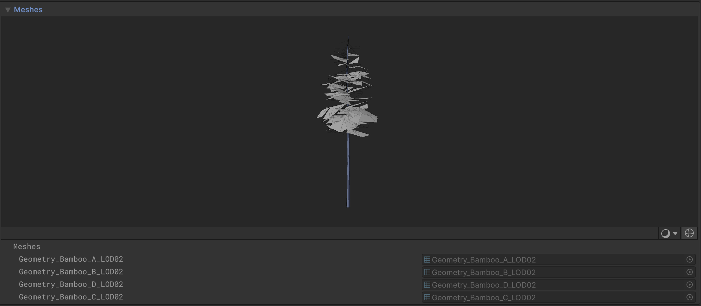
해당 렌더링 이벤트에서 사용된 메시 목록을 보여준다. 잘못된 메시나 LOD가 적용되지 않거나 지나치게 많은 정점을 가진 메시를 찾는데 활용된다.

## 정리
프레임 디버거는 아래와 같은 상황에서 효과적이다.

- 렌더링 중인 버텍스 수는 많은데 어떤 오브젝트가 그려지고 있는지 파악하기 어려울때
- 렌더링 순서 오류나 Z-Fighting 또는 오브젝트가 갑자기 사라지는 현상과 같은 그래픽 버그를 추적할 때
- 배치가 깨지는 원인을 확인하고 싶을때

## 한계점
프레임 디버거는 CPU에서 생성된 유니티 렌더링 이벤트 = C# API 수준의 렌더 패스를 보여주는 도구이기에 각 렌더링 이벤트에 대한 GPU 타임은 측정할 수 없다. 또한 Metal, DirectX와 같은 네이티브 그래픽스 API 수준의 렌더링 명령어도 표시되지 않는다.