## 그래픽스 관련 설정
### Auto Graphics API
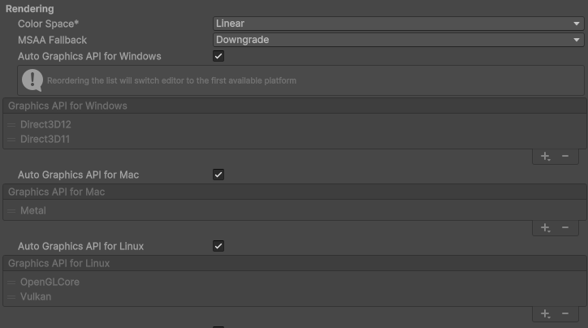

> Project Setting => Player => Other settings => Rendering

사용가능한 모든 그래픽스 API에 대한 코드와 셰이더가 빌드에 포함된다. 해당 옵션을 활성화 할 시 ㅊ빌드 크기가 증가한다. 상황에 따라서 Auto 세팅이 아닌 직접 Graphics APIs에서 사용할 그래픽스를 직접 지정하는 방식을 추천한다.

현재 사진의 유니티 버전에서는 따로 Auto Graphics API가 없고, 각 플렛폼마다 지정을 할 수 있게 되어 있다.

### 멀티 스레드 렌더링 설정
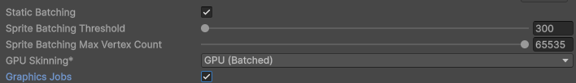

> Project Setting => Player => Other settings => Rendering
Multithreaded Rendering = 활성화, Graphics Jobs = 데스크톱 => 활성화 / 모바일은 확인 후 사용

(유니티6 3.19f 버전에서는 Multithreaded Rendering 옵션이 안보인다)
멀티 스레드 렌더링이 활성화된 상태에서는 그래픽스 잡까지 활성화 할시 렌더링 작업이 여러 잡 스레드로 분산되어서 성능이 추가로 향상될 수 있다. 해당 이유로 데스크탑에서는 그래픽스 잡 활성화가 추천된다.

모바일의 경우는 멀티 스레드 처리 효율이 낮기때문에 여러 스레드로 잡을 분배하는 리소스가 오히려 최적화에 악영향을 줄 수 있기에 확인 후 사용이 권장된다.

### 정적 배칭(Static Batching)
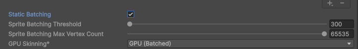

> Project Setting => Player => Other settings => Rendering

움직이지 않는 메시를 겹합해 드로우 콜을 줄이는 정적 배치를 활성화한다.

렌더링 설능을 향상시키기에 가능한 한 사용하는 것이 권장된다.

여러 메시를 결합하여 새로운 메시를 만들어 내기에 메모리 사용량을 증가시킬 수 있기에 상황에 따라 메모리 사용량을 줄이고 싶다면 비활성화 할 수 있다. 혹은 프롭 게임 오브젝트를 정적 배치 대상에서 제외하는 방식으로 비슷한 효과를 만들어 낼 수 있다.

### GPU Skinning
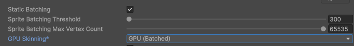

> Project Setting => Player => Other settings => Rendering

메시 스키닝과 블렌드 셰이프 작업을 CPU와 GPU중 어디에서 처리할지 결정하는 설정이다.

대부분의 상황에서 **GPU(Batched)**가 성능에 좋다

모바일 기기의 GPU성능이 지속적으로 향상되고 있고, 보통 성능 병목은 CPU에서 발생한다고 전재한고 보통 활성화 한다.

혹시나 GPU성능이 낮은 기기에서는 비활성화가 고려될 수 있다.

### 메시 데이터 최적화
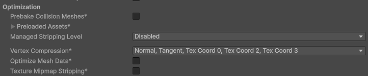

> Project Setting => Player => Other settings => Optimization

메시 에셋에는 다양한 버텍스 채널이 포함될 수 있다. Optimize Mesh Data 설정은 메시에서 사용되지 않는 버텍스 채널을 제거한다. 이를 통해서 메시 에셋의 크기를 줄이고 렌더링 설능을 개선할 수 있다.

### 셰이더 베리언트 로딩 설정
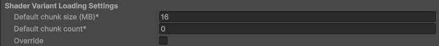

> Project Setting => Player => Other settings => Shader Variant Loading Settings

셰이더 베리언트 청크의 크기와 메모리에 로드할 양을 결정한다.

메모리에서 셰이더 베리언트가 차지하는 크기를 줄이는데 효과적이다.

> **셰이더 베리언트 청크(Shader Variant Chunk)**
압축된 셰이더 베리언트 데이터가 모여 있는 하나의 메모리 묶음 단위

Default Chunk Size = 하나의 셰이더 베리언트 청크가 가질 수 있는 최대 크기
Default Chunk Count = 각 셰이더에 대해 메모리에 로드할 수 있는 최대 청크수

셰이더 코드에서 컴파일된 셰이더 베리언트는 청크 단위로 나뉘어 압축된다.

하나의 셰이더는 여러 개의 베리언트를 생성하고 이 베리언트는 여러 청크에 나뉘어 포함될 수 있다.

씬을 렌더링할 시 셰이더의 모든 베리언트가 아닌 일부 베리언트만 사용되는 경우가 많다. 이 경우 기본 청크 개수 설정에 다라 필요한 베리언트가 포함된 청크만 로드할지 혹은 해당 셰이더의 모든 청크를 로드할지가 결정된다.

> 기본 청크 개수를 0으로 설정시 해당 셰이더가 처음 사용되는 지점에서 모든 청크를 메모리에 로드한다.

> 기본 청크 개수를 0보다 큰 값으로 설정하면 필요한 베리언트가 포함된 청크만 메모리에 로드된다. 설정한 개수만큼의 청크만 메모리에 유지되며 초과분은 언로드한다.

만약 설정을 매우 낮은 값으로 설정시 오히려 청크 교체 비용이 과다하게 생겨 CPU 성능 부하를 만들 수 있다.

## 스크립팅 설정
### 스크립팅 백엔드
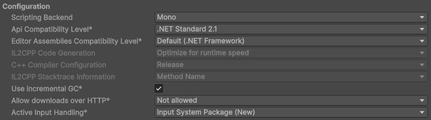

> Project Setting => Player => Other settings => Configuration

IL2CPP / Mono 2택 1로 선택이 가능하다.

모파일 플렛폼에서 안드로이드, IOS는 앱스토어 정책상 64비트 아키텍처를 지원해야 한다. 유니티의 Mono 백엔드는 모바일 환경에서 64비트를 지원하지 않기 때문에 모바일의 경우는 IL2CPP가 강제된다.

Mono는 런타임에 IL코드를 컴파일하는 JIT 방식으로 동작한다. 이로 인해서 런타임 코드 실행 속도가 상대적으로 느리다.

IL2CPP는 모든 코드를 미리 컴파일하는 AOT 방식을 사용한다. 빌드 시간과 결과물의 코드 크기는 Mono보다 증가하지만 런타임 코드 실행 속도는 빠르다. 다만, 런타임에서 코드를 실행할 수 없기 때문에 리플렉션을 통해 런타임에 코드를 생성하는 기능을 사용하는 코드는 제거해야 한다.

### IL2CPP Code Generation
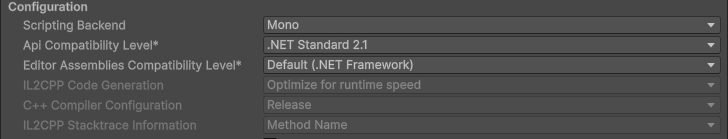

> Project Setting => Player => Other settings => Configuration

IL2CPP 빌드 시 다음 2가지 옵션중 하나를 선택할 수 있게 한다.

1. 런타임 코드 실행 속도를 우선시하는 설정
2. 빌드 속도와 코드 크기를 줄이는 설정

IL2CPP 컴파일러는 프로젝트에서 사용되는 모든 타입을 CPP 코드로 변환해야 한다. C#은 제네릭으로부터 파생되는 모든 타입을 개별적으로 컴파일하기에 컴파일된 코드의 크기가 커질 수 있다.

**Faster builds**
IL2CPP의 Full Generic Sharing 기능을 활용해 모든 제네릭 타입을 개별적으로 컴파일하지 않고 공유 코드를 생성한다. 이를 통해 빌드된 코드의 크기를 줄일 수 있다.

빌드 시간을 줄이는데 효과적이기에 개발시 빠른 테스트가 필요한 상황 혹은 제네릭 타입이 많아 컴파일 결과물이 큰 프로젝트에서 유용하다. 하지만 제네릭 타입 수가 많아 코드 크기가 커진 상황에서는 비효율적일 가능성이 높다.

**Faster Runtime**
대부분 상황에서 권장되는 옵션이다.

Full Generic Sharing으로 생성된 공유 코드는 타입 추론, 검사 과정에서 추가 비용이 발생할 수 있기에 런타임 성능 저하를 가져올 수 있다.

### Use Incremetal GC

> Project Setting => Player => Other settings => Configuration

점진적 GC 사용이다. 활성화가 대부분 추천된다.

기존의 GC는 메인 스레드를 완전히 정지시킨 후 GC이후에도 메모리가 부족하면 동기적으로 힙 확장을 수행한다. 이때에 게임이 멈추는 현상이 발생할 수 있다.

점진적 GC를 사용할 경우 GC를 여러 프레임에 나누어 실행하며 힙 확장을 비동기로 병행한다.

해당 옵션을 사용하면 메인 스레드가 완전히 정지하지 않기에 프리즈 현상을 줄일 수 있다.

### 스택 트레이스 비활성화
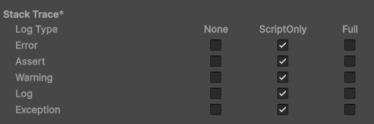

> Project Setting => Player => Other settings => Stack Trace

로그 레벨별로 스택 트레이스 표시 여부를 지정한다.

- None = 스택 트레이스를 표시하지 않는다
- ScriptOnly = 관리되는 코드 = C# 스크립트 수준까지만 표시한다
- Full = 네이티브 코드를 포함해 스택 트레이스를 모두 표시한다

스택 트레이스를 포함하면 출력되는 문자열 길이가 길어지며 메모리 할당과 물자열 연산량이 증가한다.

유니티는 로그에 스택 트레이스를 포함하는 리플렉션을 사용한다.

## 코드 스트립
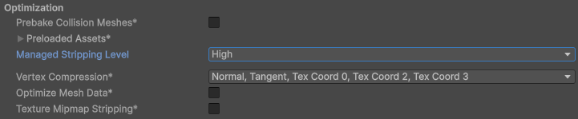

> Project Setting => Player => Other settings => Optimization

사용하지 않는 코드를 제거해 빌드 크기와 메모리 사용량을 줄인다.

### 엔진 코드 스트립
사용되지 않는 엔진 코드를 빌드에서 제거한다. 대부분의 프로젝트에서 활성화 하는 것이 좋다.

에러가 발생시 비활성화 하는 것이 권장된다.

### 관리되는 코드 스트립핑
사용되지 않는 C# 코드를 빌드에서 제거해 빌드크기, 메모리 사용량을 줄인다.

#### 동작 방식
정적 분석을 통해 도달 불가능한 코드를 찾아 제거한다.

- 루트마크
MonoBehaviour, ScriptableObject 타입 등 반드시 포함되어야 한다고 판단되는 코드를 루트로 마크함

- 참조마크
루트가 참조하는 다른 타입을 마크함 EX = MonoBehaviour를 상속한 타 클레스

- 재귀마크
마크된 타입이 다시 참조하는 다른 타입을 계속해서 마크함

- 보존
마크된 코드는 사용 중인 코드로 판단해 빌드에 포함함

#### 리플렉션과의 관계
리플렉션을 통해 간접적으로 참조되는 타입은 정적 분석 과정에서 사용되지 않는 코드로 분류될 수 있다. 이로 인해 실행 중 해당 타입을 찾지 못해 예외가 발생할 수 있다.

해당 문제를 해결하기 위해 아래의 수단을 사용한다.

1. 리플렉션 사용 빈도 낮추기
타입을 문자열, 동적 로딩이 아닌 직접 참조 방식으로 수정한다.

2. link.xml 파일 사용
보존할 어셈블리나 타입을 명시해 스트리핑 대상에서 제외한다.

3. Preserve 속성 사용
C#의 해당 속성을 적용한 타입은 스트리핑 대상에서 제외된다.

#### 관리되는 코드 스트리핑 레벨
스트리핑의 공격성을 조절한다. 가능하면 높은 레벨을 사용해야 하며, 이상적으로 High, 현실적으로는 Medium이 사용된다.

레벨이 높아질수록 리플렉션을 통해 간접적으로 참조되는 타입이 제거될 가능성도 함께 높아진다.

아래의 단계를 통해 레벨을 높여 나가는 것이 추천된다.

1. 초기 설정을 Low로 맞춘다
2. 넓은 범위를 대상으로 link.xml로 마크한다
3. 스트리핑 레벨을 높이며 xml에서 숫자를 줄여 나간다

## 물리 설정
### Fixed Timestep 조정
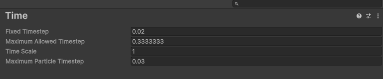

> Project Setting => Time => Fixed Timestep

물리 시뮬레이션의 스텝 크기와 FixedUpdate()의 주기를 결정한다.

- 작은 값일시 물리 연산과 FixedUpdate()의 주기가 짧아져 시뮬레이션의 정확도가 높아지나 CPU 성능 소모가 증가한다

- 높은 값일시 위와 반대로 시뮬레이션 정확도가 낮아지나 CPU 성능 소모가 줄어든다

엄격한 물리 시뮬레이션이 필요 없다면 조금더 큰 값을 사용하여 성능을 절약할 수 있다.

### Maximum Allowed Timestep 줄이기
Maximum Allowed Timestep은 처리 지연으로 인해 누적된 타입스텝을 한 프레임에서 최대 얼마만큼 처리할지를 제한한다. 해당 설정을 이전 프레임에 실행되지 못한 FixedUpdate()를 해당 프레임에 최대 몇 회 실행할지 제한하는 개념으로 이해할 수 있다.

일반적으로 잘못 알려진 FixedUpdate()의 동작 방식은 프레임과 무관하게 4ms 주기로 독자적으로 작동한다고 인식되어 있다. 실제로는 FixedUpdate()는 각 프레임 전반부에 실행되여 Update()보다 먼저 실행된다.

> 한 프레임이 10ms의 처리 시간을 가지고 물리 갱신이 40ms일 경우, Update() 이하 U가 10ms, FixedUpdate() 이하 F가 4ms를 사용한다는 가정하에 각 프레임 시간
물리 시뮬레이션 시간차를 줄이기 위해서 현재 프레임에서 물리 시뮬레이션을 가능한 많이 해야 하기에 첫 프레임에 F를 2번 실행하면 8ms가 소모되며 2ms가 밀리게 된다. 직후 바로 U가 실행되어 10ms가 소모된다. 이후 두번째 프레임에서 앞서 10ms - 8ms로 2ms가 밀리게 되고 이전 U에서 실행한 시간인 10ms를 더하여 앞선 프레임과 물리 시뮬레이션이 12ms차이가 나게 된다. 이때 F를 3번 실행하여 12ms - 12ms로 누적시간을 맞춰준다. 이후 3, 4 프레임 ~ 이후도 같이 진행된다.

만약 FixedUpdate()를 한 프레임에서 여러번 호출하게 되면 해당 프레임 자체가 시간을 많이 사용하여 다음 프레임이 밀리게 되는 악순환이 벌어질 수 있다.

### Prebake Collision Meshes
메시 콜라이더를 사용할 때 이 설정을 활성화 하면 메시 콜리더용 물리데이터인 콜리전 메시를 빌드 시점에 미리 생성한다.

비활성화시 메시 콜리어더가 처음 사용될 때 해당 데이터를 런타임에 메인 스레드에서 계산한다. 이 과정에서 씬 로딩 시간이 길어지거나 런타임중 히칭이 발생할 수 있다.

### 충돌 이벤트 재사용하기
충돌 이벤트가 발생할 때 새로운 콜백 객체를 매번 생성하지 않고 미리 생성된 객체를 재사용하도록 한다.

여러번 호출되는 충돌 이벤트로 발생하는 GC 부하를 낮출 수 있다.

### 트랜스폼 싱크 해체하기
비활성화된 상태에서는 트랜스폼 변경 시 물리 엔진과 즉시 동기화하지 않는다. 동기화가 필요한 트랜스폼 변경은 누적되어 FixedUpdate()에서의 물리 업데이트 시점, 혹은 사용자가 Physics.SyncTransforms를 호출하여 동기화 할 수 있다.

## 발열 제어를 위한 Idle 타임 확보
모바일 게임의 경우 발영을 제어하는 것이 중요하다. 발열은 배터리 소모를 증가시키며 기기에서 CPU 성능을 제한할 수 있다.

이를 해소하기 위해 CPU, GPU를 최적화를 하는것이 선행되고, 이미 되어 있다면 프레임 레이트를 낮추어 Idle 타임을 확보하는 방향으로 발열 제어를 시도할 수 있다.

- GPU
프레임을 낮출시 렌더링 연산 빈도와 메모리 접근 주기가 길어져 사용률이 낮아진다

- CPU
활동도가 높은 상태면 특정 코어가 병목 없이 계속 작업을 수행하고, 이는 에너지 소모 증가를 유발하여 발열이 생기게 된다.

발열 제어를 위해서 메인 스레드의 한 프레임 처리시간 중 35% 정도를 CPU 대기 상태로 남기는 것이 좋다.

## 기타 프로젝트 설정 최적화
### 빌트인 패키지 제거
사용하지 않는 빌트인 패키지를 프로젝트에서 제거하면 빌드 크기와 메모리 사용량을 줄일 수 있다.
