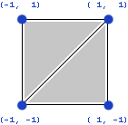
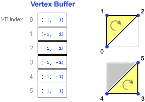
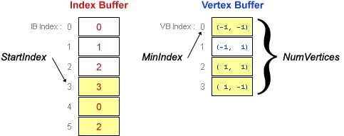
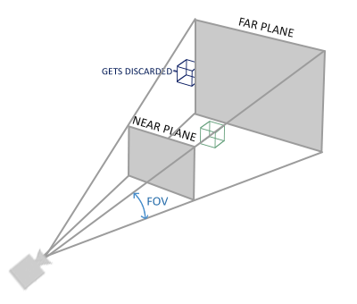

**파이프라인이란?**
여러 명령어가 중첩되어서 프로그램이나 하나의 작업을 실행하게 도와주는 과정(연산의 집합)

**렌더링 파이프라인(레스터라이제이션)**

- 레이트레이싱 파이프라인
- 레스터라이제이션 파이프라인
- 메쉬 셰이더 파이프라인

**시대가 변해도 달라지지 않은 공부**
1. 업데이트 되는 그래픽스 라이프러리
2. 3차원 데이터를 어떻게 2차원 데이터로 변환할 수 있는가?
3. 위의 과정에서 어떤 알고리즘과 어떤 수학적 로직이 사용되는지

 

# Input Assembler 파이프라인
3차원 모델 하나를 3차원 세상에 나타내기 위해서 가장 먼제 해야 하는 것은?

모델은 점 = vertex로 이루어져 있고 점이 모여 폴리곤 = 점들의 집합이 된다.

게임에서는 주로 삼각형을 가지고 3D 폴리곤을 정의하고, 이 정점 데이터들을 운반하는 자료 구조를 Vertex Buffer하고 한다.

>**정점 버퍼(Vertex Buffer)**
정점 데이터는 본래 RAM 공간에 존재한다 이를 GPU에서 연산하기 위해서 GRAM으로 이동시켜 줘야 한다. 이때 GPU 메모리 공간에 Vertex Buffer를 만들어 데이터를 이동시킨다(복사). 추가적으로 파이프라인도 GPU의 메모리에 올려둔다.

**Index Buffer**
정점들의 인덱스를 저장하고 있는 버퍼들. 삼각형으로 사각형을 그리기 위해서는 6개의 점이 필요하다(2 * 3). 사각형을 구성하는 정점을 4개로 두고 한붓 그리기처럼 중복해서 그려주는 방식을 사용하는 기능.

  
  

인덱스 버퍼를 통하면 정점이 4개만 존재하더라도 사각형을 삼각형 기반으로 그릴 수 있게 된다.

**GPU**
3차원 데이터를 2차원 모니터에 출력을 도와주는 하드웨어

>CPU와의 차이점
CPU내의 ALU 연산장치가 무거운 연산을 가능하게 하지만 숫자가 적고 GPU의 ALU는 모니터의 픽셀 하나 하나에 색을 넣기 위한 목적이기에 가벼운 연산을 위해 존재하는 대신 숫자가 많다

**Primitive Topology**
정점들을 이용하여 어떤 도형을 만들어야 하는지 알려주는 정보

**Input Assembler는 정점들의 데이터를 읽고 도형으로 조립하는 단계의 일을 한다.**

# Vertex Shader 단계
Input Assembler에서 받은 점정 정보들의 정보로 도형을 그렸지만 해당 정보들은 로컬 좌표계에 있기 때문에 해당 데이터들을 화면에 그대로 출력시 0, 0, 0에 겹쳐 렌더링되기에 월드 좌표계 = 공간 좌표계로 변환해야 한다.

Local Space에서 World Space 로의 변환이 필요할때, 혹은 플레이어 = 카메라가 중신이 되는 공간, View Space로의 변환도 필요하다. 마지막으로 Projection 변환을 거쳐서 최종적인 Clip Space라는 공간으로 변환해준다.

## 월드 공간 변환
Local Space은 3차원 세상에서 표현될 자신을 기준으로 정점을 정의한 영역이다. 해당 좌표계 값을 제각각의 위치로 정의하는 World Space로 이동시키는 변환이다.

## 카메라 공간
월드 변환이 완료되면 모든 물체가 한 공간에 모여지면 특정 시점에서 물체를 관찰할 수 있게 해야 한다. 이때 관찰자 시점의 가상 카메라가 필요하며, 이 카메라가 볼 수 있는 공간을 뷰 공간이라고 한다.

월드 공간의 모든 물체를 카메라 공간으로 변화하게 되면 효율적으로 여러가지 효과나 렌더링을 진행할 수 있다.

카메라의 시점은 시야각 제한이 생기는데, 이때에 Field Of View, Aspect 등에 의해 제한되는 가시 영역을 뷰 볼륨이라고 한다. 이렇게 생성된 뷰 볼륨에 Near, Far 정보를 전달하여 절두체의 영역을 다시 정의한다.

## View Frustrum
절두체 공간의 밖에 있는 물체는 그리지 않는데, 이는 계산의 효율성을 위해 도입된 개념이다. 물체가 절두체의 경계에 걸치면 밖 부분은 렌더링을 하지 않는데, 이를 Clipping이라고 한다. 해당 연산은 카메라 변환에서 이뤄지지 않고 이후 Clip Space => Rasterizer 를 수행할때 연산된다.

## 투영 변환
카메라 변환에서 월드의 모든 물체를 카메라 공간으로 정점을 재계산 하였을때 해당 공간은 아직 3차원이다. 컴퓨터 모니터는 2차원의 배열이기에 앞에서 계산한 3차원 공간을 어떻게 2차원으로 어떻게 표현할 수 있는지 생각해야 한다.

이는 이미 정의되어 있는데, 이를 원근법이라 표현한다.

투영 변환은 원근법을 구현하기 위해 카메라 공간에서 정의된 절두체를 3차원 클립공간으로 변환하는 것을 의미한다.

> 투영 변환은 3차원의 물체를 2차원 평면으로 바꾸는 것이 아니라 3차원 물체로 변환되는 것을 주의해야 한다.

투영 변환을 거친 물체들을 확인할시 절두체 뒤쪽의 폴리곤은 작아지게 되는데, 이것이 원근법이 적용되었다 할 수 있다.

> 왜 바로 2차원 변환을 하지 않는가?
절두체는 복잡한 정보이기에 연산이 매우 복잡해진다. Camera Space => Clipping Space로의 변환을 통해 연산식을 단순화 하는 과정이 투영 변환이다.